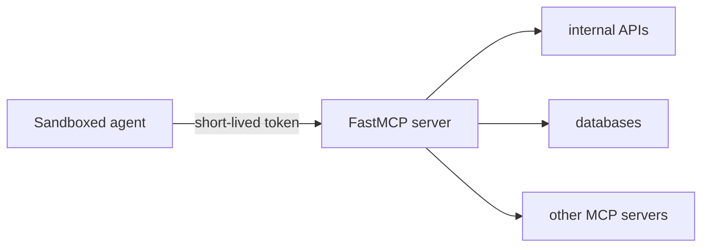

本指南适用于这样的部署：Agent 运行在隔离容器、子进程或远程 worker 中，但仍然需要 MCP 访问。在这种设置中，沙箱本身也会成为你的信任边界的一部分。

核心建议很简单：使用 FastMCP 作为能力边界。运行远程 FastMCP 服务端，使用短期、带作用域的凭据对沙箱进行认证，并把特权凭据保留在服务端侧。

## 何时使用此模式

此模式适用于：

- agent 运行在临时容器或子进程中
- 你不希望长期凭据进入该沙箱
- 你需要按运行、租户或作业限定作用域
- 沙箱必须间接调用内部 API、数据库或上游 MCP 服务端

如果你正在构建本地桌面集成，STDIO 和常规本地配置可能已经足够。本指南面向这样的情况：沙箱隔离程度较高，secret 分发、凭据生命周期和权限边界都成为设计的一部分。

## 沙箱化部署中有什么变化

桌面 MCP 客户端通常运行在开发者机器上，并使用开发者控制的配置启动本地服务端。沙箱化 agent 不同：

- 它通常运行在临时容器或子进程中。
- 它的文件系统可能会在事后被检查。
- 它的环境变量范围可能比你预期的更宽。
- 你可能会为不同用户、租户或作业并发启动许多沙箱。

这意味着本地可接受的便利模式，在沙箱中会变得有风险。把 GitHub token、数据库密码或云凭据直接传入沙箱，会制造一个本不需要存在的 secret 分发问题。

更安全的方式是让 FastMCP 服务端成为唯一拥有特权访问的组件，并让沙箱通过 MCP 调用它。

## 推荐架构

默认使用如下形态：



沙箱获得：

- MCP 服务端 URL
- 作用域限定到作业、租户或运行的一枚短期 token
- 不获得任何长期上游凭据

FastMCP 服务端负责执行特权工作：

- 验证沙箱 token
- 根据 token claims、scopes 或其他服务端侧策略授权请求
- 只暴露该沙箱应该看到的工具
- 代表沙箱与内部 API、数据库或上游 MCP 服务端通信

关键设计规则很简单：

<Tip>
给沙箱能力，而不是凭据。
</Tip>

有了这条边界后，接下来的问题就是沙箱如何连接、服务端如何验证并授权它，以及如何设计沙箱允许调用的工具。

## 沙箱化 Agent 优先使用 HTTP

对于沙箱，请优先使用远程 HTTP 服务端，而不是本地 STDIO 服务端。

STDIO 仍然非常适合本地开发，但远程 HTTP 服务端通常是沙箱化 agent 更好的生产边界，因为：

- 认证是显式的
- 服务端生命周期独立于沙箱生命周期
- secret 保留在服务端
- 一个部署可以安全服务多个沙箱
- 审计和撤销集中在一个地方

这意味着沙箱应作为客户端连接：

```python
from fastmcp import Client
from fastmcp.client.auth import BearerAuth

client = Client(
    "https://sandbox-tools.example.com/mcp",
    auth=BearerAuth("short-lived-sandbox-token"),
)
```

你的 FastMCP 服务端应远程运行：

```python
from fastmcp import FastMCP

mcp = FastMCP("Sandbox Tools")

if __name__ == "__main__":
    mcp.run(transport="http", host="0.0.0.0", port=8000)
```

生产传输设置请参见 [HTTP 部署](/zh/deployment/http)。

## 使用短期、带作用域的凭据

对于沙箱化 agent，通常更清晰的做法是为沙箱会话签发凭据，而不是把长期上游凭据直接放进容器。

实践中，这通常意味着为每个沙箱、运行或租户签发短期 bearer token，并在 FastMCP 服务端上使用 token verifier 进行验证。

```python
from fastmcp import FastMCP
from fastmcp.server.auth.providers.jwt import JWTVerifier

auth = JWTVerifier(
    jwks_uri="https://auth.example.com/.well-known/jwks.json",
    issuer="https://auth.example.com",
    audience="sandbox-mcp",
)

mcp = FastMCP("Sandbox Tools", auth=auth)
```

token 应标识沙箱的作用域。根据你的系统，它可以表示作业、租户、运行，或经用户授权的会话。常见有用 claims 包括：

- sandbox 或 run id
- tenant 或 installation id
- 适用时的 user 或 actor id
- 过期时间
- 可选的能力 scopes

避免在许多沙箱之间共享静态 token。如果某个沙箱 token 泄漏，你希望影响范围小、有效期短。

Token 验证只是边界的一半。授权仍应发生在 FastMCP 服务端：使用 scopes、claims、中间件或自定义 auth 检查来决定该沙箱实际可以访问哪些工具和资源。

例如，你可以全局验证 token，同时在特定工具上要求更窄的 scope：

```python
from fastmcp import FastMCP
from fastmcp.server.auth import require_scopes
from fastmcp.server.auth.providers.jwt import JWTVerifier

auth = JWTVerifier(
    jwks_uri="https://auth.example.com/.well-known/jwks.json",
    issuer="https://auth.example.com",
    audience="sandbox-mcp",
)

mcp = FastMCP("Sandbox Tools", auth=auth)

@mcp.tool(auth=require_scopes("write:summary"))
def write_summary(content: str) -> str:
    return f"Stored summary with {len(content)} characters"
```

验证模式请参见 [Token 验证](/zh/servers/auth/token-verification)。策略执行请参见[授权](/zh/servers/authorization)。

## 暴露能力，而不是原始访问

沙箱不应该需要：

- GitHub app 私钥
- 数据库密码
- 上游 OAuth 客户端 secret
- 云提供商凭据

相反，应暴露在服务端侧执行特权工作的 MCP 工具。

适合面向沙箱的工具通常长这样：

- `get_recent_updates`
- `write_summary`
- `fetch_repo_context`
- `publish_review_comment`

这些工具描述的是沙箱需要的能力，而不是执行该能力所需的底层持凭据操作。

这种区别很重要。像 `write_summary` 这样的工具让服务端决定把 summary 持久化到哪里以及如何持久化。像 `run_sql` 或 `call_internal_api` 这样的工具则把权限和策略推入沙箱，而那里更难控制。

当工具窄而结构化时，沙箱化 agent 表现最好：

```python
from fastmcp import FastMCP

mcp = FastMCP("Sandbox Tools")

@mcp.tool
def write_summary(content: str) -> str:
    """存储当前运行的最终 summary。"""
    return f"Stored summary with {len(content)} characters"

@mcp.tool
def publish_review_comment(pr_number: int, body: str) -> str:
    """为指定 pull request 排队创建 review comment。"""
    return f"Queued comment for PR #{pr_number}"
```

与 `mutate_state(kind: str, payload: dict)` 这类宽泛兜底工具相比，这些工具更容易审计、更容易授权，也更容易让 agent 稳定使用。

窄工具还允许你为不同工具表达不同策略，而不是创建一个大型特权逃逸口。

## 当上游系统权限更高时使用代理

如果沙箱需要访问其他 MCP 服务端或内部系统，请把 FastMCP 放在它们前面，而不是把 secret 转发进沙箱。

这正是代理能力有用的地方。面向公网的 FastMCP 服务端可以先认证沙箱，然后用更强凭据把允许的能力转发给上游系统。

典型示例包括：

- 位于内部 MCP 服务端前的沙箱安全 MCP 网关
- 位于内部 HTTP API 前的 FastMCP 层
- 面向某个作业作用域、代理 Git 提供商、issue tracker 或存储系统的服务端

如果上游系统本身就是 MCP 服务端，FastMCP 的代理支持会非常合适。请参见 [MCP 代理](/zh/servers/providers/proxy)。

## 沙箱化客户端的 mcp.json

如果你的沙箱化 agent 通过 `mcp.json` 配置，请保持配置最小化。让它指向远程 FastMCP 服务端，并且只传入沙箱真正需要的值。

```json
{
  "mcpServers": {
    "sandbox-tools": {
      "url": "https://sandbox-tools.example.com/mcp",
      "transport": "http"
    }
  }
}
```

在许多系统中，认证由启动器或环境注入，而不是硬编码到 `mcp.json` 中。对沙箱来说，这通常是正确权衡。避免把长期凭据烘焙进生成的配置文件，也不要把 `mcp.json` 当作 secret 材料应该存放的地方。

这一节需要做的全部事情就是告诉沙箱服务端在哪里。把认证和 secret 处理放到其他地方。

配置细节请参见 [MCP.json](/zh/integrations/mcp-json-configuration)。

## 常见错误

沙箱化部署中反复出现的错误通常就这几个：

- 把长期 API key 直接传入沙箱
- 把沙箱里的辅助脚本当作安全边界
- 暴露宽泛的变更工具，而不是窄能力
- 对所有沙箱使用同一个共享 token
- 在生产中依赖 STDIO 继承配置

这些做法一开始都能工作。但一旦有多个租户、多个作业，或发生需要快速撤销访问的事件，就会变得痛苦。

## 生产检查清单

发布面向沙箱的 FastMCP 服务端前，请检查：

- 沙箱通过 HTTP 连接，而不是使用特权本地凭据。
- Token 是短期的，并按运行、租户或作业限定作用域。
- FastMCP 服务端在每个请求上验证 token。
- 长期 secret 保留在服务端侧。
- 工具是窄的、明确的、结构化的。
- 上游特权系统位于 FastMCP 服务端或代理之后。
- 撤销和审计位于服务端边界，而不是沙箱内部。

如果采用这些默认做法，沙箱支持就不再是特殊情况，而会成为普通部署模式：隔离 worker 与受约束的 FastMCP 表面通信，服务端集中处理特权部分。
