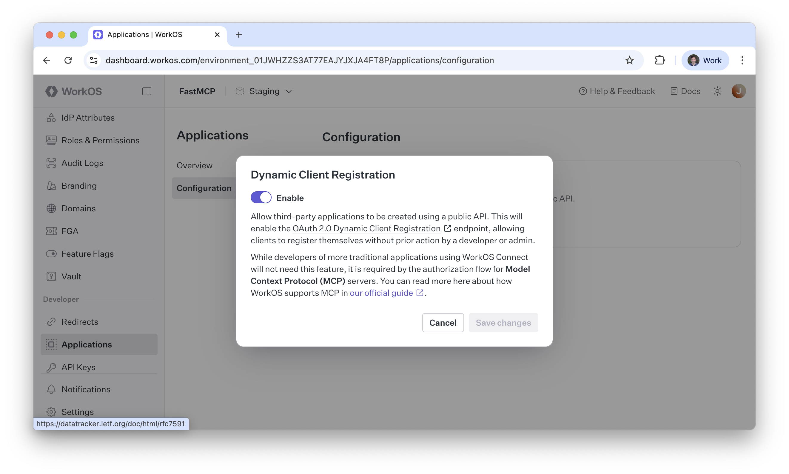

import { VersionBadge } from "/snippets/version-badge.mdx"

<VersionBadge version="2.11.0" />

本指南向您展示如何使用 WorkOS 的 **AuthKit**（一个完整的身份验证和用户管理解决方案）来保护您的 FastMCP 服务器。此集成使用[**远程 OAuth**](/zh/servers/auth/remote-oauth) 模式，其中 AuthKit 处理用户登录，您的 FastMCP 服务器验证令牌。


## 配置
### 先决条件

在开始之前，您需要：
1.  一个 **[WorkOS 账户](https://workos.com/)** 和一个新的**项目**。
2.  在您的 WorkOS 项目中配置的 **[AuthKit](https://www.authkit.com/)** 实例。
3.  您的 FastMCP 服务器的 URL（开发时可以是 localhost，例如 `http://localhost:8000`）。

### 步骤 1：AuthKit 配置

在您的 WorkOS 仪表板中，启用 AuthKit 并配置以下设置：

<Steps>
<Step title="启用动态客户端注册">
    转到 **Applications → Configuration** 并启用 **Dynamic Client Registration**。这允许 MCP 客户端自动注册到您的应用程序。

    
</Step>

<Step title="记录您的 AuthKit 域名">
    在配置页面上找到您的 **AuthKit Domain**。它看起来像 `https://your-project-12345.authkit.app`。您在 FastMCP 服务器配置中需要这个域名。
</Step>
</Steps>

### 步骤 2：FastMCP 配置

创建您的 FastMCP 服务器文件并使用 `AuthKitProvider` 自动处理所有 OAuth 集成：

```python server.py
from fastmcp import FastMCP
from fastmcp.server.auth.providers.workos import AuthKitProvider

# AuthKitProvider 会自动发现 WorkOS 端点
# 并配置 JWT 令牌验证
auth_provider = AuthKitProvider(
    authkit_domain="https://your-project-12345.authkit.app",
    base_url="http://localhost:8000"  # 使用您的实际服务器URL
)

mcp = FastMCP(name="AuthKit 安全应用程序", auth=auth_provider)
```

## 测试

要测试您的服务器，您可以使用 `fastmcp` CLI 在本地运行它。假设您已将上述代码保存到 `server.py`（在将 `authkit_domain` 和 `base_url` 替换为您的实际值之后！），您可以运行以下命令：

```bash
fastmcp run server.py --transport http --port 8000
```

现在，您可以使用 FastMCP 客户端测试在身份验证后是否可以访问您的服务器：

```python
from fastmcp import Client
import asyncio

async def main():
    async with Client("http://localhost:8000/mcp/", auth="oauth") as client:
        assert await client.ping()

if __name__ == "__main__":
    asyncio.run(main())
```


## 环境变量

<VersionBadge version="2.12.1" />

对于生产部署，请使用环境变量而不是硬编码凭据。

### 提供程序选择

设置此环境变量允许自动使用 AuthKit 提供程序，而无需在代码中显式实例化它。

<Card>
<ParamField path="FASTMCP_SERVER_AUTH" default="未设置">
设置为 `fastmcp.server.auth.providers.workos.AuthKitProvider` 以使用 AuthKit 身份验证。
</ParamField>
</Card>

### AuthKit 特定配置

这些环境变量为 AuthKit 提供程序提供默认值，无论它是手动实例化的还是通过 `FASTMCP_SERVER_AUTH` 配置的。

<Card>
<ParamField path="FASTMCP_SERVER_AUTH_AUTHKITPROVIDER_AUTHKIT_DOMAIN" required>
您的 AuthKit 域（例如，`https://your-project-12345.authkit.app`）
</ParamField>

<ParamField path="FASTMCP_SERVER_AUTH_AUTHKITPROVIDER_BASE_URL" required>
您的 FastMCP 服务器的公共 URL（例如，`https://your-server.com` 或开发时的 `http://localhost:8000`）
</ParamField>

<ParamField path="FASTMCP_SERVER_AUTH_AUTHKITPROVIDER_REQUIRED_SCOPES" default="[]">
必需的 OAuth 作用域的逗号、空格或 JSON 分隔列表（例如，`openid profile email` 或 `["openid", "profile", "email"]`）
</ParamField>
</Card>

示例 `.env` 文件：
```bash
# 使用 AuthKit 提供程序
FASTMCP_SERVER_AUTH=fastmcp.server.auth.providers.workos.AuthKitProvider

# AuthKit 配置
FASTMCP_SERVER_AUTH_AUTHKITPROVIDER_AUTHKIT_DOMAIN=https://your-project-12345.authkit.app
FASTMCP_SERVER_AUTH_AUTHKITPROVIDER_BASE_URL=https://your-server.com
FASTMCP_SERVER_AUTH_AUTHKITPROVIDER_REQUIRED_SCOPES=openid,profile,email
```

设置环境变量后，您的服务器代码简化为：

```python server.py
from fastmcp import FastMCP

# 身份验证从环境中自动配置
mcp = FastMCP(name="AuthKit 安全应用")
```