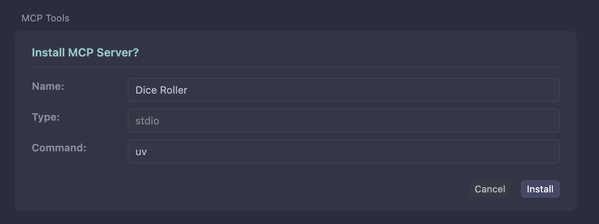

import { VersionBadge } from "/snippets/version-badge.mdx"
import { LocalFocusTip } from "/snippets/local-focus-zh.mdx"

<LocalFocusTip />

Cursor 通过包括 STDIO、SSE 和 Streamable HTTP 在内的多种传输方法支持 MCP 服务器，允许您使用 FastMCP 服务器的自定义工具、资源和提示来扩展 Cursor 的 AI 助手。

## 要求

此集成使用 STDIO 传输在本地运行您的 FastMCP 服务器。对于远程部署，您可以使用 HTTP 或 SSE 传输运行您的 FastMCP 服务器，并在 Cursor 的设置中直接配置它。

## 创建服务器

本指南中的示例将使用以下简单的掷骰子服务器，保存为 `server.py`。

```python server.py
import random
from fastmcp import FastMCP

mcp = FastMCP(name="骰子投掷器")

@mcp.tool
def roll_dice(n_dice: int) -> list[int]:
    """掷 `n_dice` 个六面骰子，并返回结果。"""
    return [random.randint(1, 6) for _ in range(n_dice)]

if __name__ == "__main__":
    mcp.run()
```

## 安装服务器

### FastMCP CLI
<VersionBadge version="2.10.3" />

在 Cursor 中安装 FastMCP 服务器的最简单方法是使用 `fastmcp install cursor` 命令。这会自动处理配置、依赖管理，并使用深度链接打开 Cursor 来安装服务器。

```bash
fastmcp install cursor server.py
```

安装命令支持与 `run` 命令相同的 `file.py:object` 表示法。如果未指定对象，它将自动在您的文件中查找名为 `mcp`、`server` 或 `app` 的 FastMCP 服务器对象：

```bash
# 如果您的服务器对象名为 'mcp'，这些是等效的
fastmcp install cursor server.py
fastmcp install cursor server.py:mcp

# 如果您的服务器有不同的名称，请使用显式对象名
fastmcp install cursor server.py:my_custom_server
```

运行命令后，Cursor 将自动打开并提示您安装服务器。命令将是 `uv`，这是预期的，因为这是一个 Python STDIO 服务器。点击“安装”确认：



#### 依赖

FastMCP 为您的 Cursor 服务器提供多种管理依赖的方式：

**单个包**：使用 `--with` 标志指定您的服务器需要的包。您可以多次使用此标志：

```bash
fastmcp install cursor server.py --with pandas --with requests
```

**要求文件**：对于有 `requirements.txt` 文件的项目，使用 `--with-requirements` 一次安装所有依赖：

```bash
fastmcp install cursor server.py --with-requirements requirements.txt
```

**可编辑包**：开发本地包时，使用 `--with-editable` 以可编辑模式安装它们：

```bash
fastmcp install cursor server.py --with-editable ./my-local-package
```

或者，您可以在服务器代码中直接指定依赖：

```python server.py
from fastmcp import FastMCP

mcp = FastMCP(
    name="Dice Roller",
    dependencies=["pandas", "requests"]
)
```

#### Python 版本和项目配置

使用这些选项控制服务器的 Python 环境：

**Python 版本**：使用 `--python` 指定您的服务器应该使用的 Python 版本。当您的服务器需要特定 Python 功能时，这是必需的：

```bash
fastmcp install cursor server.py --python 3.11
```

**项目目录**：使用 `--project` 在特定项目上下文中运行您的服务器。这确保 `uv` 发现所有项目配置文件并使用正确的虚拟环境：

```bash
fastmcp install cursor server.py --project /path/to/my-project
```

#### 环境变量

<Warning>
Cursor 在完全隔离的环境中运行服务器，无法访问您的 shell 环境或本地安装的应用程序。您必须显式传递服务器需要的任何环境变量。
</Warning>

如果您的服务器需要环境变量（如 API 密钥），您必须包含它们：

```bash
fastmcp install cursor server.py --server-name "Weather Server" \
  --env API_KEY=your-api-key \
  --env DEBUG=true
```

或者从 `.env` 文件中加载它们：

```bash
fastmcp install cursor server.py --server-name "Weather Server" --env-file .env
```

<Warning>
**必须安装 `uv` 并在系统 PATH 中可用**。Cursor 在其自己的隔离环境中运行，需要 `uv` 来管理依赖。
</Warning>

### 生成 MCP JSON

<Note>
**使用上面的一流集成以获得最佳体验。** MCP JSON 生成对于高级用例、手动配置或与其他工具集成很有用。
</Note>

您可以生成 MCP JSON 配置以供手动使用：

```bash
# 生成配置并输出到标准输出
fastmcp install mcp-json server.py --server-name "Dice Roller" --with pandas

# 将配置复制到剪贴板以便轻松粘贴
fastmcp install mcp-json server.py --server-name "Dice Roller" --copy
```

这会生成标准的 `mcpServers` 配置格式，可以与任何兼容 MCP 的客户端一起使用。

### 手动配置

为了更好地控制配置，您可以手动编辑 Cursor 的配置文件。配置文件位于：
- **所有平台**：`~/.cursor/mcp.json`

配置文件是一个包含 `mcpServers` 键的 JSON 对象，其中包含每个 MCP 服务器的配置。

```json
{
  "mcpServers": {
    "dice-roller": {
      "command": "python",
      "args": ["path/to/your/server.py"]
    }
  }
}
```

更新配置文件后，您的服务器应该在 Cursor 中可用。

#### 依赖

如果您的服务器有依赖，您可以使用 `uv` 或其他包管理器来设置环境。

手动配置依赖时，建议的方法是将 `uv` 与 FastMCP 一起使用。配置应该使用 `uv run` 来创建一个包含您指定包的隔离环境：

```json
{
  "mcpServers": {
    "dice-roller": {
      "command": "uv",
      "args": [
        "run",
        "--with", "fastmcp",
        "--with", "pandas",
        "--with", "requests", 
        "fastmcp",
        "run",
        "path/to/your/server.py"
      ]
    }
  }
}
```

您也可以在配置中手动指定 Python 版本和项目目录：

```json
{
  "mcpServers": {
    "dice-roller": {
      "command": "uv",
      "args": [
        "run",
        "--python", "3.11",
        "--project", "/path/to/project",
        "--with", "fastmcp",
        "fastmcp",
        "run",
        "path/to/your/server.py"
      ]
    }
  }
}
```

请注意，参数的顺序很重要：Python 版本和项目设置应该在包规格之前。

<Warning>
**必须安装 `uv` 并在系统 PATH 中可用**。Cursor 在其自己的隔离环境中运行，需要 `uv` 来管理依赖。
</Warning>

#### 环境变量

您也可以在配置中指定环境变量：

```json
{
  "mcpServers": {
    "weather-server": {
      "command": "python",
      "args": ["path/to/weather_server.py"],
      "env": {
        "API_KEY": "your-api-key",
        "DEBUG": "true"
      }
    }
  }
}
```

<Warning>
Cursor 在完全隔离的环境中运行服务器，无法访问您的 shell 环境或本地安装的应用程序。您必须显式传递服务器需要的任何环境变量。
</Warning>

## 使用服务器

一旦您的服务器安装完成，您就可以开始在 Cursor 的 AI 助手中使用您的 FastMCP 服务器。

尝试问 Cursor 这样的问题：

> "为我投几个骰子"

Cursor 将自动检测您的 `roll_dice` 工具并使用它来满足您的请求，返回类伺于以下内容：

> 🎲 这是您的骰子投放结果：4、6、4
> 
> 您投了 3 个骰子，总共 14 点！那个 6 点是个不错的高分！

AI 助手现在可以访问您在 FastMCP 服务器中定义的所有工具、资源和提示。