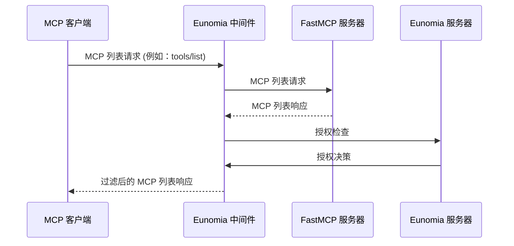
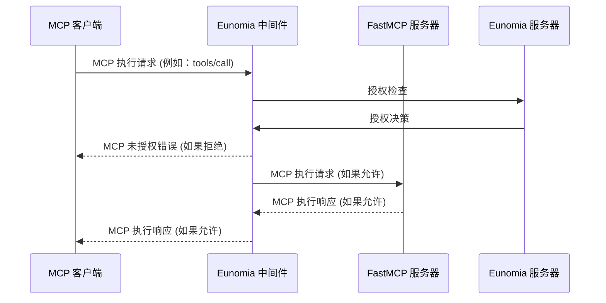

使用 **[Eunomia][eunomia-github] 授权中间件**通过一行代码添加为您的 FastMCP 服务器添加**基于策略的授权**。

控制 MCP 客户端可以在您的服务器上查看和执行的工具、资源和提示。定义动态的基于 JSON 的策略，并获得所有访问尝试和违规行为的全面审计日志。

## 工作原理

利用 FastMCP 的[Middleware][fastmcp-middleare]，Eunomia 中间件拦截所有到您服务器的 MCP 请求，并自动将 MCP 方法映射到授权检查。

### 列表操作

中间件作为列表操作（`tools/list`、`resources/list`、`prompts/list`）的过滤器，对客户端隐藏未由定义策略授权的组件。



### 执行操作

中间件作为执行操作（`tools/call`、`resources/read`、`prompts/get`）的防火墙，阻止未由定义策略授权的操作。



## 为您的服务器添加授权

<Note>
Eunomia 是一个专门处理策略决策的 AI 特定授权服务器。默认情况下，服务器嵌入在您的 MCP 服务器内运行，实现零配置，但也可以远程运行以实现集中式策略决策。

</Note>

### 创建带有授权的服务器

首先，安装 `eunomia-mcp` 包：

```bash
pip install eunomia-mcp
```

然后创建一个 FastMCP 服务器并在一行中添加 Eunomia 中间件：

```python server.py
from fastmcp import FastMCP
from eunomia_mcp import create_eunomia_middleware

# 创建您的 FastMCP 服务器
mcp = FastMCP("安全 MCP 服务器 🔒")

@mcp.tool()
def add(a: int, b: int) -> int:
    """将两个数字相加"""
    return a + b

# 为您的服务器添加中间件
middleware = create_eunomia_middleware(policy_file="mcp_policies.json")
mcp.add_middleware(middleware)

if __name__ == "__main__":
    mcp.run()
```

### 配置访问策略

在终端中使用 `eunomia-mcp` CLI 来管理您的授权策略：

```bash
# 创建默认策略文件
eunomia-mcp init

# 或者为您的 FastMCP 服务器创建自定义策略文件
eunomia-mcp init --custom-mcp "app.server:mcp"
```

这将创建 `mcp_policies.json` 文件，您可以根据访问控制需要进一步编辑。

```bash
# 编辑完成后，验证您的策略文件
eunomia-mcp validate mcp_policies.json
```

### 运行服务器

正常启动您的 FastMCP 服务器：

```bash
python server.py
```

中间件现在将拦截所有 MCP 请求并根据您的策略检查它们。请求包括通过 `X-Agent-ID`、`X-User-ID`、`User-Agent` 或 `Authorization` 等标头的代理识别，以及 MCP 方法到授权资源和操作的自动映射。

<Tip>
  有关详细的策略配置、自定义身份验证和远程部署，请访问 [Eunomia MCP 中间件仓库][eunomia-mcp-github]。
</Tip>

[eunomia-github]: https://github.com/whataboutyou-ai/eunomia
[eunomia-mcp-github]: https://github.com/whataboutyou-ai/eunomia/tree/main/pkgs/extensions/mcp
[fastmcp-middleare]: /servers/middleware
