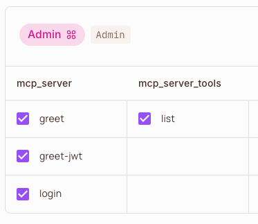
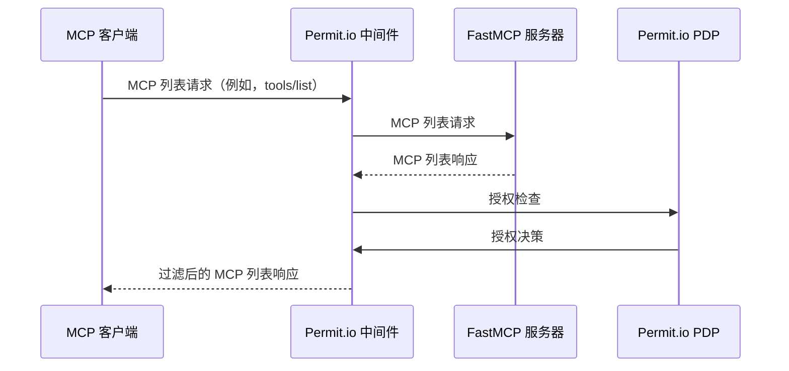
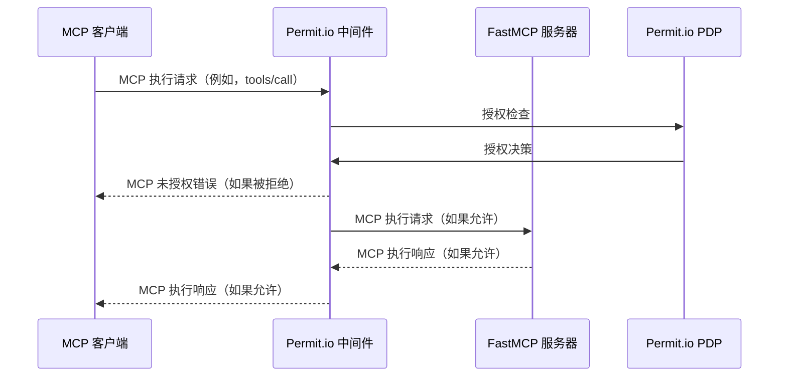
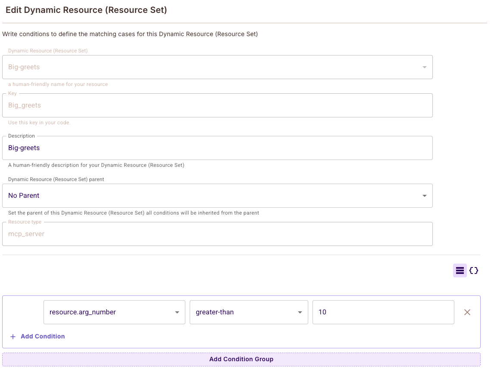
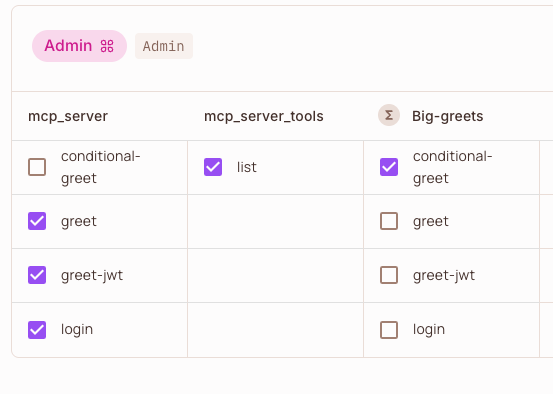

使用 **[Permit.io][permit-github] 授权中间件**通过一行代码添加为您的 FastMCP 服务器添加**基于策略的授权**。

控制 MCP 客户端可以在您的服务器上查看和执行的工具、资源和提示。使用 Permit.io 强大的 RBAC、ABAC 和 REBAC 功能定义动态策略，并获得所有访问尝试和违规行为的全面审计日志。

## 工作原理

利用 FastMCP 的[中间件][fastmcp-middleware]，Permit.io 中间件拦截所有到您服务器的 MCP 请求，并自动将 MCP 方法映射到针对您的 Permit.io 策略的授权检查；涵盖服务器方法和工具执行。

### 策略映射

中间件自动将 MCP 方法映射到 Permit.io 资源和操作：

- **MCP 服务器方法**（例如，`tools/list`、`resources/read`）：
  - **资源**：`{server_name}_{component}`（例如，`myserver_tools`）
  - **操作**：方法动词（例如，`list`、`read`）
- **工具执行**（方法 `tools/call`）：
  - **资源**：`{server_name}`（例如，`myserver`）
  - **操作**：工具名称（例如，`greet`）



*示例：在 Permit.io 中，'Admin' 角色被授予中间件映射的资源和操作权限。例如，'greet'、'greet-jwt' 和 'login' 是 'mcp_server' 资源上的操作，而 'list' 是 'mcp_server_tools' 资源上的操作。*

> **注意：**
> 不要忘记在 Permit.io 目录中为对您的 MCP 服务器进行身份验证的用户（例如 JWT 中的用户）分配相关角色（例如，Admin、User）。如果没有正确的角色分配，用户将无法访问您在策略中配置的资源和操作。
>
> 
>
> *示例：在 Permit.io 目录中，'client' 和 'admin' 用户都被分配了 'Admin' 角色，授予他们您在策略映射中定义的权限。*

有关详细的策略映射示例和配置，请参阅[详细策略映射](https://github.com/permitio/permit-fastmcp/blob/main/docs/policy-mapping.md)。

### 列表操作

中间件作为列表操作（`tools/list`、`resources/list`、`prompts/list`）的过滤器，对客户端隐藏未被定义策略授权的组件。



### 执行操作

中间件作为执行操作（`tools/call`、`resources/read`、`prompts/get`）的强制执行点，阻止未被定义策略授权的操作。



## 为您的服务器添加授权

<Note>
Permit.io 是一个云原生授权服务。您需要 Permit.io 账户和正在运行的策略决策点（PDP）才能使中间件正常工作。您可以使用 Docker 在本地运行 PDP，或使用 Permit.io 的云 PDP。
</Note>

### 先决条件

1. **Permit.io 账户**：在 [permit.io](https://permit.io) 注册
2. **PDP 设置**：在本地运行 Permit.io PDP 或使用云 PDP（仅 RBAC）
3. **API 密钥**：从仪表板获取您的 Permit.io API 密钥

### 运行 Permit.io PDP

使用 Docker 在本地运行 PDP：

```bash
docker run -p 7766:7766 permitio/pdp:latest
```

或使用云 PDP URL：`https://cloudpdp.api.permit.io`

### 创建带有授权的服务器

首先，安装 `permit-fastmcp` 包：

```bash
# 使用 UV（推荐）
uv add permit-fastmcp

# 使用 pip
pip install permit-fastmcp
```

然后创建一个 FastMCP 服务器并添加 Permit.io 中间件：

```python server.py
from fastmcp import FastMCP
from permit_fastmcp.middleware.middleware import PermitMcpMiddleware

mcp = FastMCP("安全的 FastMCP 服务器 🔒")

@mcp.tool
def greet(name: str) -> str:
    """按名称问候用户"""
    return f"您好，{name}！"

@mcp.tool
def add(a: int, b: int) -> int:
    """两个数相加"""
    return a + b

# 添加 Permit.io 授权中间件
mcp.add_middleware(PermitMcpMiddleware(
    permit_pdp_url="http://localhost:7766",
    permit_api_key="your-permit-api-key"
))

if __name__ == "__main__":
    mcp.run(transport="http")
```

### 配置访问策略

在 Permit.io 仪表板中创建您的授权策略：

1. **创建资源**：定义像 `mcp_server` 和 `mcp_server_tools` 这样的资源
2. **定义操作**：添加像 `greet`、`add`、`list`、`read` 这样的操作
3. **创建角色**：定义像 `Admin`、`User`、`Guest` 这样的角色
4. **分配权限**：授予角色对特定资源和操作的访问权
5. **分配用户**：在 Permit.io 目录中为用户分配角色

有关逐步设置说明和故障排除，请参阅[入门指南和常见问题](https://github.com/permitio/permit-fastmcp/blob/main/docs/getting-started.md)。

#### 示例策略配置

策略在 Permit.io 仪表板中定义，但您也可以使用 [Permit.io Terraform 提供程序](https://github.com/permitio/terraform-provider-permitio)在代码中定义策略。


```terraform
# 资源
resource "permitio_resource" "mcp_server" {
  name = "mcp_server"
  key  = "mcp_server"
  
  actions = {
    "greet" = { name = "greet" }
    "add"   = { name = "add" }
  }
}

resource "permitio_resource" "mcp_server_tools" {
  name = "mcp_server_tools"
  key  = "mcp_server_tools"
  
  actions = {
    "list" = { name = "list" }
  }
}

# 角色
resource "permitio_role" "Admin" {
  key         = "Admin"
  name        = "Admin"
  permissions = [
    "mcp_server:greet",
    "mcp_server:add", 
    "mcp_server_tools:list"
  ]
}
```

您也可以使用 [Permit.io CLI](https://github.com/permitio/permit-cli)、[API](https://api.permit.io/scalar) 或 [SDK](https://github.com/permitio/permit-python) 来管理策略，以及直接用 REGO（Open Policy Agent 的策略语言）编写策略。

有关包括 ABAC 和 RBAC 配置在内的完整策略示例，请参阅[示例策略](https://github.com/permitio/permit-fastmcp/tree/main/docs/example_policies)。

### 身份管理

中间件支持多种身份提取模式：

- **固定身份**：对所有请求使用固定身份
- **基于请求头**：从 HTTP 请求头提取身份
- **基于 JWT**：提取和验证 JWT 令牌
- **基于源**：使用 MCP 上下文源字段

有关详细的身份模式配置和环境变量，请参阅[身份模式和环境变量](https://github.com/permitio/permit-fastmcp/blob/main/docs/identity-modes.md)。

#### JWT 身份验证示例

```python
import os

# 配置 JWT 身份提取
os.environ["PERMIT_MCP_IDENTITY_MODE"] = "jwt"
os.environ["PERMIT_MCP_IDENTITY_JWT_SECRET"] = "your-jwt-secret"

mcp.add_middleware(PermitMcpMiddleware(
    permit_pdp_url="http://localhost:7766",
    permit_api_key="your-permit-api-key"
))
```

### 带有工具参数的 ABAC 策略

中间件支持基于属性的访问控制（ABAC）策略，可以将工具参数作为属性进行评估。工具参数会自动展平为单独的属性（例如，`arg_name`、`arg_number`），用于细粒度的策略条件。



*示例：创建带有 `resource.arg_number greater-than 10` 等条件的动态资源，仅当数字参数超过 10 时才允许 `conditional-greet` 工具。*

#### 示例：条件访问

创建一个带有 `resource.arg_number greater-than 10` 等条件的动态资源，仅当数字参数超过 10 时才允许 `conditional-greet` 工具。

```python
@mcp.tool
def conditional_greet(name: str, number: int) -> str:
    """仅当数字 > 10 时问候用户"""
    return f"您好，{name}！您的数字是 {number}"
```



*示例：Admin 角色被授予在"Big-greets"动态资源上的"conditional-greet"操作访问权限，而其他工具如"greet"、"greet-jwt"和"login"则在基础"mcp_server"资源上被授予权限。*

有关全面的 ABAC 配置和高级策略示例，请参阅[带有工具参数的 ABAC 策略](https://github.com/permitio/permit-fastmcp/blob/main/docs/policy-mapping.md#abac-policies-with-tool-arguments)。

### 运行服务器

正常启动您的 FastMCP 服务器：

```bash
python server.py
```

中间件现在将拦截所有 MCP 请求并根据您的 Permit.io 策略进行检查。请求包括通过配置的身份模式进行用户识别，以及 MCP 方法到授权资源和操作的自动映射。

## 高级配置

### 环境变量

使用环境变量配置中间件：

```bash
# Permit.io 配置
export PERMIT_MCP_PERMIT_PDP_URL="http://localhost:7766"
export PERMIT_MCP_PERMIT_API_KEY="your-api-key"

# 身份配置
export PERMIT_MCP_IDENTITY_MODE="jwt"
export PERMIT_MCP_IDENTITY_JWT_SECRET="your-jwt-secret"

# 方法配置
export PERMIT_MCP_KNOWN_METHODS='["tools/list","tools/call"]'
export PERMIT_MCP_BYPASSED_METHODS='["initialize","ping"]'

# 日志配置
export PERMIT_MCP_ENABLE_AUDIT_LOGGING="true"
```

有关所有配置选项和环境变量的完整列表，请参阅[配置参考](https://github.com/permitio/permit-fastmcp/blob/main/docs/configuration-reference.md)。

### 自定义中间件配置

```python
from permit_fastmcp.middleware.middleware import PermitMcpMiddleware

middleware = PermitMcpMiddleware(
    permit_pdp_url="http://localhost:7766",
    permit_api_key="your-api-key",
    enable_audit_logging=True,
    bypass_methods=["initialize", "ping", "health/*"]
)

mcp.add_middleware(middleware)
```

有关高级配置选项和自定义中间件扩展，请参阅[高级配置](https://github.com/permitio/permit-fastmcp/blob/main/docs/advanced-configuration.md)。

## 示例：完整的 JWT 身份验证服务器

请参阅[示例服务器](https://github.com/permitio/permit-fastmcp/blob/main/permit_fastmcp/example_server/example.py)了解基于 JWT 身份验证的完整实现。有关其他示例和使用模式，请参阅[示例服务器](https://github.com/permitio/permit-fastmcp/blob/main/permit_fastmcp/example_server/)：

```python
from fastmcp import FastMCP, Context
from permit_fastmcp.middleware.middleware import PermitMcpMiddleware
import jwt
import datetime

# 配置 JWT 身份提取
os.environ["PERMIT_MCP_IDENTITY_MODE"] = "jwt"
os.environ["PERMIT_MCP_IDENTITY_JWT_SECRET"] = "mysecretkey"

mcp = FastMCP("我的 MCP 服务器")

@mcp.tool
def login(username: str, password: str) -> str:
    """登录以获取 JWT 令牌"""
    if username == "admin" and password == "password":
        token = jwt.encode(
            {"sub": username, "exp": datetime.datetime.utcnow() + datetime.timedelta(hours=1)},
            "mysecretkey",
            algorithm="HS256"
        )
        return f"Bearer {token}"
    raise Exception("无效凭据")

@mcp.tool
def greet_jwt(ctx: Context) -> str:
    """通过从 JWT 中提取用户名来问候用户"""
    # JWT 提取由中间件处理
    return "您好，已认证用户！"

mcp.add_middleware(PermitMcpMiddleware(
    permit_pdp_url="http://localhost:7766",
    permit_api_key="your-permit-api-key"
))

if __name__ == "__main__":
    mcp.run(transport="http")
```

<Tip>
  有关详细的策略配置、自定义身份验证和高级部署模式，请访问 [Permit.io FastMCP 中间件
  仓库][permit-fastmcp-github]。有关常见问题的故障排除，请参阅[故障排除](https://github.com/permitio/permit-fastmcp/blob/main/docs/troubleshooting.md)。
</Tip>


[permit.io]: https://www.permit.io
[permit-github]: https://github.com/permitio
[permit-fastmcp-github]: https://github.com/permitio/permit-fastmcp
[Agent.Security]: https://agent.security
[fastmcp-middleware]: /servers/middleware
