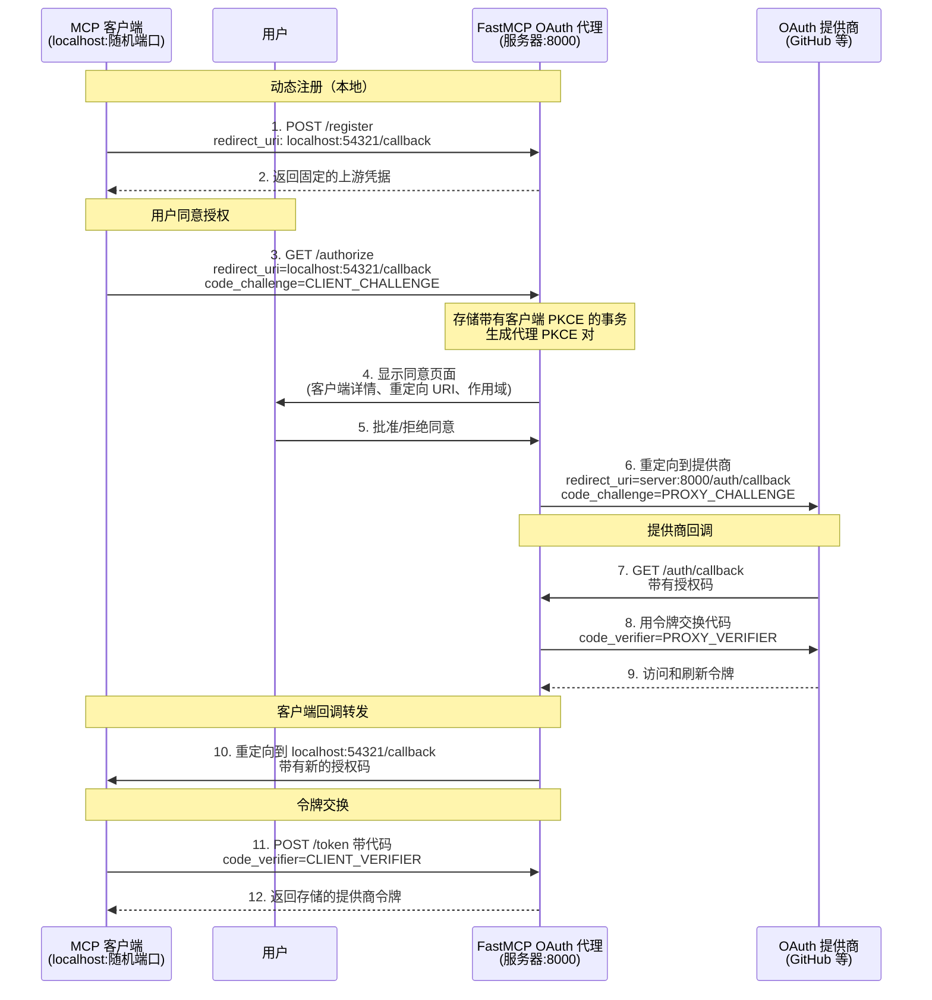

import { VersionBadge } from "/snippets/version-badge.mdx";

<VersionBadge version="2.12.0" />

OAuth 代理使 FastMCP 服务器能够与**不支持动态客户端注册（DCR）**的 OAuth 提供商进行认证。这包括几乎所有传统的 OAuth 提供商：GitHub、Google、Azure、AWS、Discord、Facebook 和大多数企业身份系统。对于支持 DCR 的提供商（如 Descope 和 WorkOS AuthKit），请使用 [`RemoteAuthProvider`](/zh/servers/auth/remote-oauth)。

MCP 客户端期望自动注册并动态获取凭据，但传统提供商需要通过其开发者控制台进行手动应用注册。OAuth 代理通过向 MCP 客户端呈现符合 DCR 的接口，同时使用您预先注册的凭据与上游提供商通信，来弥合这一差距。当客户端尝试注册时，代理返回您的固定凭据。当客户端发起授权时，代理处理回调转发的复杂性——存储客户端的动态回调 URL，使用其自己的固定回调与提供商通信，然后在令牌交换后转发回客户端。

这种方法使任何 MCP 客户端（无论是使用随机本地端口还是像 Claude.ai 这样的固定 URL）都能与任何传统 OAuth 提供商进行认证，同时保持完整的 OAuth 2.1 和 PKCE 安全性。

<Note>
  对于支持 OIDC 发现的提供商（带有 OIDC 配置的 Auth0、Google、Azure AD），
  可以考虑使用 [`OIDC
  代理`](/zh/servers/auth/oidc-proxy) 进行自动配置。OIDC 代理
  扩展了 OAuth 代理，可以从提供商的
  `/.well-known/openid-configuration` URL 自动发现端点，简化设置。
</Note>

## 实现

### 提供商设置要求

在使用 OAuth 代理之前，您需要在您的 OAuth 提供商处注册您的应用程序：

1. **在提供商的开发者控制台中注册您的应用程序**（GitHub 设置、Google Cloud 控制台、Azure 门户等）
2. **配置重定向 URI** 为您的 FastMCP 服务器 URL 加上您选择的回调路径：
   - 默认：`https://your-server.com/auth/callback`
   - 自定义：`https://your-server.com/your/custom/path`（如果您设置了 `redirect_path`）
   - 开发：`http://localhost:8000/auth/callback`
3. **获取您的凭据**：客户端 ID 和客户端密钥
4. **记录 OAuth 端点**：授权 URL 和令牌 URL（通常可以在提供商的 OAuth 文档中找到）

<Warning>
  您在提供商处配置的重定向 URI 必须与您的
  FastMCP 服务器的 URL 加上回调路径完全匹配。如果您在 OAuth 代理中自定义了 `redirect_path`，
  请相应地更新您的提供商的重定向 URI。
</Warning>

### 基本设置

以下是如何使用任何提供商实现 OAuth 代理：

```python
from fastmcp import FastMCP
from fastmcp.server.auth import OAuthProxy
from fastmcp.server.auth.providers.jwt import JWTVerifier

# 为您的提供商配置令牌验证
# 请参阅令牌验证指南了解特定提供商的设置
token_verifier = JWTVerifier(
    jwks_uri="https://your-provider.com/.well-known/jwks.json",
    issuer="https://your-provider.com",
    audience="your-app-id"
)

# 创建 OAuth 代理
auth = OAuthProxy(
    # 提供商的 OAuth 端点（来自他们的文档）
    upstream_authorization_endpoint="https://provider.com/oauth/authorize",
    upstream_token_endpoint="https://provider.com/oauth/token",

    # 您注册的应用凭据
    upstream_client_id="your-client-id",
    upstream_client_secret="your-client-secret",

    # 令牌验证（请参阅令牌验证指南）
    token_verifier=token_verifier,

    # 您的 FastMCP 服务器的公共 URL
    base_url="https://your-server.com",

    # 可选：自定义回调路径（默认为 "/auth/callback"）
    # redirect_path="/custom/callback",
)

mcp = FastMCP(name="My Server", auth=auth)
```

### 配置参数

<Card icon="code" title="OAuthProxy 参数">
<ParamField body="upstream_authorization_endpoint" type="str" required>
  您的 OAuth 提供商的授权端点 URL（例如 `https://github.com/login/oauth/authorize`）
</ParamField>

<ParamField body="upstream_token_endpoint" type="str" required>
  您的 OAuth 提供商的令牌端点 URL（例如
  `https://github.com/login/oauth/access_token`）
</ParamField>

<ParamField body="upstream_client_id" type="str" required>
  您注册的 OAuth 应用程序的客户端 ID
</ParamField>

<ParamField body="upstream_client_secret" type="str" required>
  您注册的 OAuth 应用程序的客户端密钥
</ParamField>

<ParamField body="token_verifier" type="TokenVerifier" required>
  一个 [`TokenVerifier`](/zh/servers/auth/token-verification) 实例，用于验证
  提供商的令牌
</ParamField>

<ParamField body="base_url" type="AnyHttpUrl | str" required>
  OAuth 端点可访问的公共 URL，**包括任何挂载路径**（例如 `https://your-server.com/api`）。

  此 URL 用于构建 OAuth 回调 URL 和操作端点。在路径前缀下挂载时，在 `base_url` 中包含该前缀。单独使用 `issuer_url` 指定认证服务器元数据的位置（通常在根级别）。
</ParamField>

<ParamField body="redirect_path" type="str" default="/auth/callback">
  OAuth 回调的路径。必须与您在 OAuth 应用程序中配置的重定向 URI 匹配

</ParamField>

<ParamField body="upstream_revocation_endpoint" type="str | None">
  提供商令牌撤销端点的可选 URL
</ParamField>

<ParamField body="issuer_url" type="AnyHttpUrl | str | None">
  OAuth 认证服务器元数据的颁发者 URL（默认为 `base_url`）。

  当您的 MCP 服务器在路径前缀下挂载时（例如 `/api`），请将此设置为您根级别的 URL，以避免 OAuth 发现期间的 404 日志。MCP 客户端首先尝试按 RFC 8414 的路径范围发现，如果您的认证服务器元数据在根级别，这将失败。

  **挂载示例：**
  ```python
  auth = GitHubProvider(
      base_url="http://localhost:8000/api",  # OAuth 端点在 /api 下
      issuer_url="http://localhost:8000"     # 认证服务器元数据在根级别
  )
  ```

  没有 `issuer_url`，客户端将尝试 `/.well-known/oauth-authorization-server/api`（404），然后回退到 `/.well-known/oauth-authorization-server`（成功）。将 `issuer_url` 设置为根级别可以消除 404 尝试。

  **何时使用：**
  - **默认（`None`）**：使用 `base_url` 作为颁发者 - 在根路径的简单部署
  - **根级别 URL**：在路径前缀下挂载 - 避免 404 日志

  有关完整的挂载示例，请参阅 [HTTP 部署指南](/zh/deployment/http#mounting-authenticated-servers)。
</ParamField>

<ParamField body="service_documentation_url" type="AnyHttpUrl | str | None">
  您服务文档的可选 URL
</ParamField>

<ParamField body="forward_pkce" type="bool" default="True">
  是否将 PKCE（代码交换证明密钥）转发到上游 OAuth
  提供商。启用后且客户端使用 PKCE 时，代理生成其自己的
  PKCE 参数向上游发送，同时单独验证客户端的 PKCE。
  这确保了在两个层级（客户端到代理
  和代理到上游）的端到端 PKCE 安全性。 - `True`（默认）：为支持的提供商转发 PKCE
  （Google、Azure、AWS、GitHub 等） - `False`：仅在上游
  提供商不支持 PKCE 时禁用
</ParamField>

<ParamField body="token_endpoint_auth_method" type="str | None">
  上游 OAuth 服务器的令牌端点认证方法。控制
  代理在与上游提供商交换授权码和刷新
  令牌时如何进行认证。 - `"client_secret_basic"`：在授权头中发送凭据
  （最常见） - `"client_secret_post"`：在请求体中发送
  凭据（某些提供商要求） - `"none"`：无
  认证（用于公共客户端） - `None`（默认）：使用 authlib 的默认值
  （通常是 `"client_secret_basic"`） 如果您的提供商需要
  特定的认证方法且默认方法不起作用，请设置此项。
</ParamField>

<ParamField body="allowed_client_redirect_uris" type="list[str] | None">
  MCP 客户端允许的重定向 URI 模式列表。模式支持
  通配符（例如 `"http://localhost:*"`、`"https://*.example.com/*"`）。 -
  `None`（默认）：允许所有重定向 URI（为了 MCP/DCR 兼容性） -
  空列表 `[]`：不允许任何重定向 URI - 自定义列表：仅允许匹配
  的模式 这些模式适用于 MCP 客户端环回重定向，不适用于
  上游 OAuth 应用重定向 URI。
</ParamField>

<ParamField body="valid_scopes" type="list[str] | None">
  OAuth 提供商所有可能的有效作用域列表。这些通过
  `/.well-known` 端点向客户端公布。如果未指定，默认为来自您的 TokenVerifier 的 `required_scopes`。

</ParamField>

<ParamField body="extra_authorize_params" type="dict[str, str] | None">
  转发到上游授权端点的额外参数。对于不属于标准 OAuth2 流程的提供商特定参数很有用。

  例如，Auth0 需要一个 `audience` 参数来颁发 JWT 令牌：
  ```python
  extra_authorize_params={"audience": "https://api.example.com"}
  ```

  这些参数会添加到发送到上游提供商的每个授权请求中。
</ParamField>

<ParamField body="extra_token_params" type="dict[str, str] | None">
  在代码交换和令牌刷新期间转发到上游令牌端点的额外参数。对于令牌操作期间的提供商特定要求很有用。

例如，某些提供商在令牌交换期间需要额外的上下文：

```python
extra_token_params={"audience": "https://api.example.com"}
```

这些参数包含在所有发送到上游提供商的令牌请求中。

</ParamField>

<ParamField body="client_storage" type="AsyncKeyValue | None">

<VersionBadge version="2.13.0" />
  用于持久化 OAuth 客户端注册和上游令牌的存储后端。

  **默认行为：**
  默认情况下，客户端会自动持久化到加密磁盘存储，只要文件系统保持可访问，就可以在服务器重启后继续存活。这意味着 MCP 客户端只需要注册一次，就可以无缝重新连接。磁盘存储使用从 JWT 签名密钥（默认从上游客户端密钥派生）派生的密钥进行加密。为了使客户端注册在上游客户端密钥轮换后继续存活，您应该提供 JWT 签名密钥或您自己的 client_storage。

对于具有多个服务器或云部署的生产部署，请参阅 [存储后端](/zh/servers/storage-backends) 了解可用选项。

<Warning>
  **提供自定义存储时**，将其包装在 `FernetEncryptionWrapper` 中以加密静态的敏感 OAuth 令牌：

  ```python
  from key_value.aio.stores.redis import RedisStore
  from key_value.aio.wrappers.encryption import FernetEncryptionWrapper
  from cryptography.fernet import Fernet
  import os

  auth = OAuthProxy(
      ...,
      jwt_signing_key=os.environ["JWT_SIGNING_KEY"],
      client_storage=FernetEncryptionWrapper(
          key_value=RedisStore(host="redis.example.com", port=6379),
          fernet=Fernet(os.environ["STORAGE_ENCRYPTION_KEY"])
      )
  )
  ```

  没有加密，上游 OAuth 令牌将以明文存储。
</Warning>

使用内存存储测试（未加密）：

```python
from key_value.aio.stores.memory import MemoryStore

# 使用内存存储进行测试（重启时丢失客户端）
auth = OAuthProxy(..., client_storage=MemoryStore())
```

</ParamField>

<ParamField body="jwt_signing_key" type="str | bytes | None">

<VersionBadge version="2.13.0" />
  用于签署颁发给客户端的 FastMCP JWT 令牌的密钥。接受任何字符串或字节 - 将使用 HKDF 派生为适当的 32 字节加密密钥。

  **默认行为（`None`）：**
  使用 PBKDF2 从上游客户端密钥派生 32 字节密钥。

  **对于生产环境：**
  提供显式密钥（例如，从环境变量），以使用固定密钥而不是从上游客户端密钥派生的密钥。这允许您在云环境中安全管理密钥，允许密钥在多个实例中工作，并允许您在不丢失客户端注册的情况下轮换密钥。

  ```python
  import os

  auth = OAuthProxy(
      ...,
      jwt_signing_key=os.environ["JWT_SIGNING_KEY"],  # 任何足够复杂的字符串！
      client_storage=RedisStore(...)  # 持久化存储
  )
  ```

  有关完整的生产设置，请参阅 [HTTP 部署 - OAuth 令牌安全](/zh/deployment/http#oauth-token-security)。
</ParamField>


<ParamField body="require_authorization_consent" type="bool" default="True">
  是否在授权 MCP 客户端之前需要用户同意。启用后（默认），用户会看到一个同意页面，显示哪个客户端正在请求访问权限，通过确保用户明确批准新客户端来防止[混乱代理攻击](https://modelcontextprotocol.io/specification/2025-06-18/basic/security_best_practices#confused-deputy-problem)。

  **默认行为（True）：**
  用户在首次授权时会看到同意页面。同意选择通过签名 cookie 记住，因此用户只需要批准每个客户端一次。这可以防止恶意客户端冒充用户。

  **禁用同意（False）：**
  授权直接进入上游提供商，无需用户确认。仅对安全权衡可接受的本地开发或测试环境使用。

  ```python
  # 仅限开发/测试 - 跳过同意页面
  auth = OAuthProxy(
      ...,
      require_authorization_consent=False  # ⚠️ 安全警告：仅适用于本地/测试
  )
  ```

  <Warning>
    禁用同意会移除重要的安全层。仅在您完全控制所有连接客户端的本地开发或测试环境中禁用。
  </Warning>
</ParamField>
</Card>

### 使用内置提供商

FastMCP 包含了常见服务的预配置提供商：

```python
from fastmcp.server.auth.providers.github import GitHubProvider

auth = GitHubProvider(
    client_id="your-github-app-id",
    client_secret="your-github-app-secret",
    base_url="https://your-server.com"
)

mcp = FastMCP(name="My Server", auth=auth)
```

可用的提供商包括 `GitHubProvider`、`GoogleProvider` 等。这些提供商自动处理令牌验证。

### 令牌验证

OAuth 代理需要兼容的 `TokenVerifier` 来验证来自您提供商的令牌。不同的提供商使用不同的令牌格式：

- **JWT 令牌**（Google、Azure）：使用带有提供商 JWKS 端点的 `JWTVerifier`
- **带有 RFC 7662 内省的不透明令牌**（Auth0、Okta、WorkOS）：使用 `IntrospectionTokenVerifier`
- **不透明令牌（提供商特定）**（GitHub、Discord）：使用提供商特定的验证器，如 `GitHubTokenVerifier`

请参阅 [令牌验证指南](/zh/servers/auth/token-verification) 了解您提供商的详细设置说明。

### 作用域配置

OAuth 作用域控制您的应用程序从用户请求哪些权限。它们通过您的 `TokenVerifier` 配置（OAuth 代理需要它来验证来自您提供商的令牌）。设置 `required_scopes` 以自动请求您的应用程序需要的权限：

```python
JWTVerifier(..., required_scopes = ["read:user", "write:data"])
```

代理创建的动态客户端将在其授权请求中自动包含这些作用域。请参阅下面的 [令牌验证](#token-verification) 部分了解详细设置。

### 自定义参数

一些 OAuth 提供商需要标准 OAuth2 流程之外的额外参数。使用 `extra_authorize_params` 和 `extra_token_params` 来传递提供商特定的要求。例如，Auth0 需要一个 `audience` 参数来颁发 JWT 令牌而不是不透明令牌：

```python
auth = OAuthProxy(
    upstream_authorization_endpoint="https://your-domain.auth0.com/authorize",
    upstream_token_endpoint="https://your-domain.auth0.com/oauth/token",
    upstream_client_id="your-auth0-client-id",
    upstream_client_secret="your-auth0-client-secret",

    # Auth0 特定的受众参数
    extra_authorize_params={"audience": "https://your-api-identifier.com"},
    extra_token_params={"audience": "https://your-api-identifier.com"},

    token_verifier=JWTVerifier(
        jwks_uri="https://your-domain.auth0.com/.well-known/jwks.json",
        issuer="https://your-domain.auth0.com/",
        audience="https://your-api-identifier.com"
    ),
    base_url="https://your-server.com"
)
```

代理还会自动将 RFC 8707 `resource` 参数从 MCP 客户端转发到支持它们的上游提供商。

## OAuth 流程



上面的流程图说明了完整的 OAuth 代理模式。让我们了解每个阶段：

### 注册阶段

当 MCP 客户端使用其动态回调 URL 调用 `/register` 时，代理使用您预配置的上游凭据响应。客户端存储这些凭据，认为它已注册了一个新应用程序。同时，代理记录客户端的回调 URL 以供后续使用。

### 授权阶段

客户端通过重定向到代理的 `/authorize` 端点来发起 OAuth。代理：

1. 存储带有其 PKCE 挑战的客户端事务
2. 为上游安全生成自己的 PKCE 参数
3. 向用户显示带有客户端详情、重定向 URI 和请求作用域的同意页面
4. 如果用户批准（或客户端之前已批准），使用固定回调 URL 重定向到上游提供商

这种双重 PKCE 方法在客户端到代理和代理到提供商层都保持端到端安全性。同意步骤通过确保您在每个客户端可以完成授权之前明确批准它来防止混乱代理攻击。

### 回调阶段

用户授权后，提供商会重定向回代理的固定回调 URL。代理：

1. 用提供商交换授权码获取令牌
2. 临时存储这些令牌
3. 为客户端生成新的授权码
4. 重定向到客户端的原始动态回调 URL

### 令牌交换阶段

最后，客户端与代理交换其授权码以接收提供商的令牌。代理在返回存储的令牌之前验证客户端的 PKCE 验证器。

整个流程对 MCP 客户端是透明的——它体验的是标准的 OAuth 流程与动态注册，不知道代理在幕后管理复杂性。

### 令牌架构

OAuth 代理实现了**令牌工厂模式**：而不是直接转发来自上游 OAuth 提供商的令牌，它向 MCP 客户端颁发自己的 JWT 令牌。这维持了适当的 OAuth 2.0 令牌受众边界并启用更好的安全控制。

**工作原理：**

当 MCP 客户端完成授权时，代理：

1. **从 OAuth 提供商接收上游令牌**（GitHub、Google 等）
2. **加密和存储**这些令牌使用 Fernet 加密（AES-128-CBC + HMAC-SHA256）
3. **向客户端颁发 FastMCP JWT 令牌**，使用 HS256 签名

FastMCP JWT 包含最小声明：颁发者、受众、客户端 ID、作用域、过期时间和唯一令牌标识符（JTI）。JTI 充当链接到加密上游令牌的引用。

**令牌验证：**

当客户端使用其 FastMCP 令牌发出 MCP 请求时：

1. **FastMCP 验证 JWT** 签名、过期时间、颁发者和受众
2. **使用来自验证 JWT 的 JTI 查找上游令牌**
3. **用提供商解密和验证**上游令牌

这种双层验证确保 FastMCP 令牌只能与此服务器一起使用（通过受众验证），同时保持完全的上游令牌安全性。

**令牌过期对齐：**

FastMCP 令牌生命周期与上游令牌生命周期匹配。当上游令牌过期时，FastMCP 令牌也过期，保持一致的安全边界。

**刷新令牌：**

代理颁发映射到上游刷新令牌的自己的刷新令牌。当客户端使用 FastMCP 刷新令牌时，代理刷新上游令牌并颁发新的 FastMCP 访问令牌。

### PKCE 转发

当与支持或要求 PKCE（代码交换证明密钥）的提供商合作时，OAuth 代理会自动处理 PKCE。代理生成自己的 PKCE 参数向上游发送，同时单独验证客户端的 PKCE，确保在两个层级的端到端安全性。

这通过 `forward_pkce` 参数默认启用，并与 Google、Azure AD 和 GitHub 等提供商无缝工作。仅对不支持 PKCE 的旧提供商禁用它：

```python
# 仅当上游不支持时禁用 PKCE 转发
auth = OAuthProxy(
    ...,
    forward_pkce=False  # 默认为 True
)
```

### 重定向 URI 验证

虽然 OAuth 代理默认接受所有重定向 URI（为了 DCR 兼容性），但您可以通过指定允许的模式来限制哪些客户端可以连接：

```python
# 仅允许本地主机客户端（开发常见）
auth = OAuthProxy(
    # ... 其他参数 ...
    allowed_client_redirect_uris=[
        "http://localhost:*",
        "http://127.0.0.1:*"
    ]
)

# 允许特定的已知客户端
auth = OAuthProxy(
    # ... 其他参数 ...
    allowed_client_redirect_uris=[
        "http://localhost:*",
        "https://claude.ai/api/mcp/auth_callback",
        "https://*.mycompany.com/auth/*"  # 支持通配符模式
    ]
)
```

检查您的服务器日志中"Client registered with redirect_uri"消息，以识别您的客户端使用什么 URL。

## 安全

### 密钥和存储管理

<VersionBadge version="2.13.0" />
OAuth 代理需要用于 JWT 签名和存储加密的加密密钥，以及持久化存储以在服务器重启之间维护有效令牌。

**默认行为（仅适用于开发）：**
- **Mac/Windows**：FastMCP 自动生成密钥并将其存储在您的系统密钥环中。存储默认为磁盘。令牌在服务器重启后继续存活。这**仅**适用于开发和本地测试。
- **Linux**：密钥是临时的（启动时随机盐）。存储默认为内存。令牌在服务器重启时失效。

**对于生产环境：**
一起配置以下参数：提供唯一的 `jwt_signing_key`（用于签署 FastMCP JWT）和共享的 `client_storage` 后端（用于存储令牌）。两者都是生产部署所必需的。使用像 Redis 或 DynamoDB 这样的网络可访问存储后端，而不是本地磁盘存储。**将您的存储包装在 `FernetEncryptionWrapper` 中以加密静态的敏感 OAuth 令牌**（请参阅上面的 `client_storage` 参数文档查看示例）。密钥接受任何密钥字符串并使用 HKDF 派生适当的加密密钥。有关完整的生产设置，请参阅 [OAuth 令牌安全](/zh/deployment/http#oauth-token-security) 和 [存储后端](/zh/servers/storage-backends)。

### 混乱代理攻击

<VersionBadge version="2.13.0" />

混乱代理攻击允许恶意客户端通过诱骗您在其身份下授予访问权限来窃取您的授权。

OAuth 代理通过将 DCR 客户端桥接到传统认证提供商来工作，这意味着多个 MCP 客户端通过单个上游 OAuth 应用程序连接。攻击者可以通过注册带有自己重定向 URI 的恶意客户端，然后向您发送授权链接来利用这个共享应用程序。当您点击它时，您的浏览器会经历 OAuth 流程——但由于您可能之前已经授权过这个 OAuth 应用程序，提供商可能会自动批准请求。授权码随后被发送到攻击者的重定向 URI，而不是合法的客户端，从而在他们使用您的凭据时获得访问权限。

#### 缓解措施

FastMCP 的 OAuth 代理要求您在任何新的或未识别的客户端尝试连接到您的服务器时明确同意。在任何授权发生之前，您会看到一个同意页面，显示客户端的详情、重定向 URI 和请求的作用域。这给您机会审查和拒绝可疑请求。一旦您批准客户端，它会被记住，因此您不会再看到该客户端的同意页面。同意机制通过 CSRF 令牌和加密签名的 cookie 实现，以防止篡改。


同意页面会自动显示您的服务器名称、图标和网站 URL（如果可用）。这些视觉标识符帮助用户确认他们正在授权正确的服务器。


**了解更多：**
- [MCP 安全最佳实践](https://modelcontextprotocol.io/specification/2025-06-18/basic/security_best_practices#confused-deputy-problem) - 官方规范指南
- [混乱代理攻击解释](https://den.dev/blog/mcp-confused-deputy-api-management/) - Den Delimarsky 的详细演练

## 环境配置

<VersionBadge version="2.12.1" />

对于生产部署，通过环境变量配置 OAuth 代理，而不是硬编码凭据：

```bash
# 指定提供商实现
export FASTMCP_SERVER_AUTH=fastmcp.server.auth.providers.github.GitHubProvider

# 提供商特定的凭据
export FASTMCP_SERVER_AUTH_GITHUB_CLIENT_ID="Ov23li..."
export FASTMCP_SERVER_AUTH_GITHUB_CLIENT_SECRET="abc123..."
export FASTMCP_SERVER_AUTH_GITHUB_BASE_URL="https://your-production-server.com"
```

使用环境配置，您的服务器代码简化为：

```python
from fastmcp import FastMCP

# 认证从环境自动配置
mcp = FastMCP(name="My Server")

@mcp.tool
def protected_tool(data: str) -> str:
    """此工具现在受 OAuth 保护。"""
    return f"已处理：{data}"

if __name__ == "__main__":
    mcp.run(transport="http", port=8000)
```
