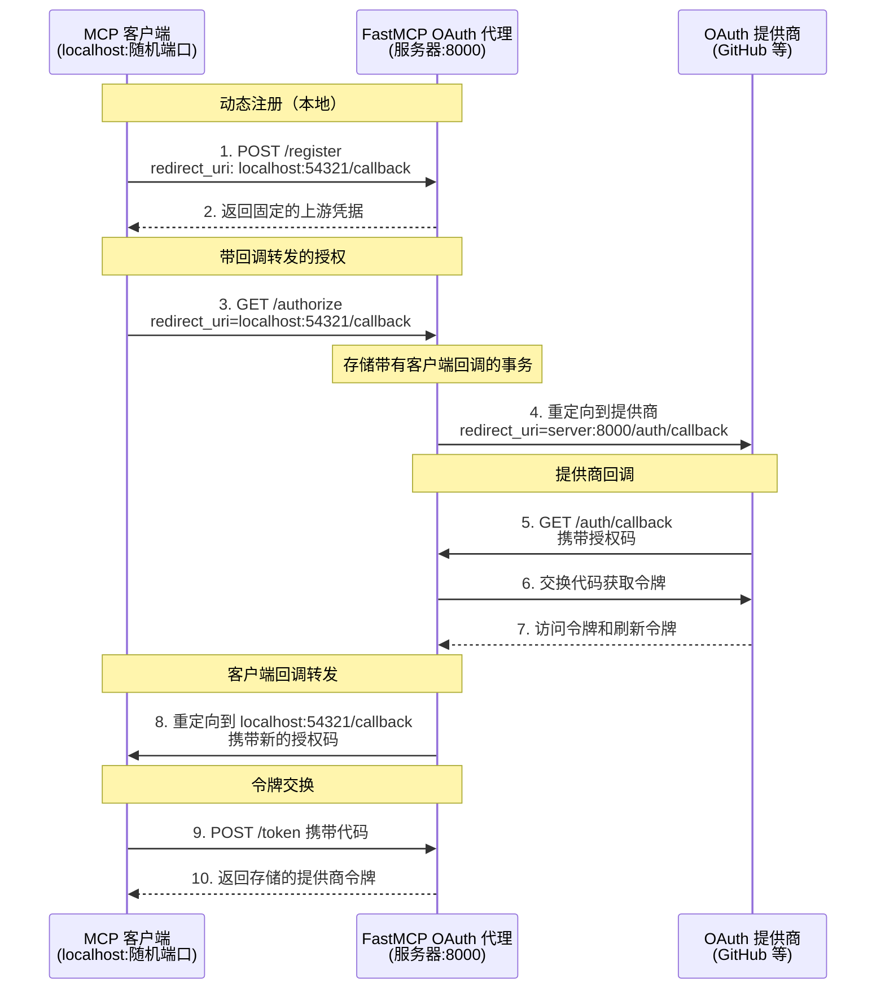

import { VersionBadge } from "/snippets/version-badge.mdx"

<VersionBadge version="2.12.0" />

OAuth 代理使您的 FastMCP 服务器能够与**不支持动态客户端注册（DCR）**的 OAuth 提供商进行身份验证。这包括几乎所有传统的 OAuth 提供商：GitHub、Google、Azure、Facebook、Discord 和大多数企业身份系统。

虽然 MCP 客户端期望动态注册并获取凭据，但这些提供商需要通过其开发者控制台进行手动应用注册。OAuth 代理通过向 MCP 客户端提供符合 DCR 的接口，同时使用您在上游提供商处预注册的凭据来弥合这一差距。

<Tip>
**何时使用 OAuth 代理与远程身份验证提供商：**
- **OAuth 代理**：用于不支持动态客户端注册的提供商（GitHub、Google、Azure 等）
- **远程身份验证提供商**：用于支持动态客户端注册的提供商（WorkOS AuthKit 等）

OAuth 代理使传统 OAuth 提供商与 MCP 的自动化身份验证流程无缝配合。
</Tip>

## 支持 DCR 与不支持 DCR 的提供商

MCP 身份验证中的关键区别是您的 OAuth 提供商是否支持**动态客户端注册（DCR）**：

- **支持 DCR 的提供商**（WorkOS、某些 OIDC 提供商）：使用 [`RemoteAuthProvider`](/zh/servers/auth/remote-oauth)
  - 客户端可以自动注册自己
  - 无需手动应用注册
  - 真正的动态身份验证流程

- **不支持 DCR 的提供商**（GitHub、Google、Azure、Discord 等）：使用 `OAuthProxy`（本指南）
  - 需要在提供商控制台中手动注册应用
  - 您获得固定的客户端 ID 和密钥
  - OAuth 代理弥合 MCP 兼容性差距

OAuth 代理通过实现始终返回您预注册凭据的本地 DCR 接口，使不支持 DCR 的提供商与 MCP 无缝配合。

## 理解 DCR 差距

**动态客户端注册（DCR）**允许 OAuth 客户端自动向授权服务器注册自己并获取凭据，无需手动干预。MCP 规范围绕此功能设计，期望客户端动态注册。

然而，大多数 OAuth 提供商不支持 DCR：

| 提供商类型 | DCR 支持 | 注册方法 | 示例 |
|-----------|----------|---------|------|
| 现代身份验证平台 | ✅ 是 | 通过 API 自动 | WorkOS AuthKit、某些 OIDC 提供商 |
| 传统 OAuth | ❌ 否 | 通过控制台手动 | GitHub、Google、Azure、Discord、Facebook |
| 企业 SSO | ❌ 否 | IT 管理员 | Okta、AD FS、PingIdentity |

不支持 DCR 的提供商要求您：
- 通过其开发者控制台手动注册应用程序
- 获取永不更改的固定客户端 ID 和密钥
- 预配置特定的重定向 URI
- 通过其 Web 界面管理凭据

这造成了根本的不兼容性：MCP 客户端期望调用注册端点并接收凭据，但传统提供商只能与预注册的应用配合使用。OAuth 代理通过接受任何客户端注册请求并返回您的固定上游凭据来解决此问题。

## OAuth 代理工作原理

OAuth 代理实现了智能回调转发模式，同时解决了 DCR 问题和重定向 URI 不匹配问题：



### 回调转发模式

OAuth 代理实现了创新的回调转发模式，解决了重定向 URI 不匹配问题：

**挑战：**
- MCP 客户端监听随机的 localhost 端口（例如，`http://localhost:54321/callback`）
- 每个客户端会话使用不同的端口
- OAuth 提供商只接受预注册的固定重定向 URI
- 注册每个可能的 localhost 端口是不可能的

**解决方案：**

代理充当中介回调处理器：

1. **动态注册**：客户端在注册期间提供其 localhost 回调 URL
2. **事务跟踪**：代理使用事务 ID 存储客户端的回调 URL
3. **固定提供商回调**：代理对提供商使用自己的固定回调 URL
4. **服务器端令牌交换**：代理接收提供商的回调并将授权码交换为令牌
5. **客户端转发**：代理使用新的授权码重定向到客户端的原始 localhost 回调
6. **令牌交付**：客户端与代理交换这个新代码以接收提供商的令牌

这种模式保持完整的 OAuth 2.1 安全性（包括 PKCE），同时使动态客户端端口能够与固定提供商回调配合工作。客户端永远不知道它在与代理通信 - 它体验到的是标准的 DCR 流程。

## 基本实现

`OAuthProxy` 类提供完整的代理实现：

<Card icon="code" title="OAuthProxy 构造函数参数">
<ParamField body="upstream_authorization_endpoint" type="str" required>
  您的 OAuth 提供商授权端点的 URL（例如，`https://github.com/login/oauth/authorize`）
</ParamField>

<ParamField body="upstream_token_endpoint" type="str" required>
  您的 OAuth 提供商令牌端点的 URL（例如，`https://github.com/login/oauth/access_token`）
</ParamField>

<ParamField body="upstream_client_id" type="str" required>
  来自您注册的 OAuth 应用程序的客户端 ID
</ParamField>

<ParamField body="upstream_client_secret" type="str" required>
  来自您注册的 OAuth 应用程序的客户端密钥
</ParamField>

<ParamField body="token_verifier" type="TokenVerifier" required>
  用于验证提供商令牌的 [`TokenVerifier`](/zh/servers/auth/token-verification) 实例
</ParamField>

<ParamField body="base_url" type="AnyHttpUrl | str" required>
  您的 FastMCP 服务器的公共 URL（例如，`https://your-server.com`）
</ParamField>

<ParamField body="redirect_path" type="str" default="/auth/callback">
  OAuth 回调的路径。必须与您在 OAuth 应用程序中配置的重定向 URI 匹配
</ParamField>

<ParamField body="upstream_revocation_endpoint" type="str | None">
  提供商令牌撤销端点的可选 URL
</ParamField>

<ParamField body="issuer_url" type="AnyHttpUrl | str | None">
  OAuth 元数据的发行者 URL（默认为 base_url）
</ParamField>

<ParamField body="service_documentation_url" type="AnyHttpUrl | str | None">
  指向您的服务文档的可选 URL
</ParamField>

<ParamField body="resource_server_url" type="AnyHttpUrl | str | None">
  资源服务器 URL（默认为 base_url）
</ParamField>
</Card>

```python
from fastmcp import FastMCP
from fastmcp.server.auth.proxy import OAuthProxy
from fastmcp.server.auth.providers.jwt import JWTVerifier

# 为您的提供商配置令牌验证
token_verifier = JWTVerifier(
    jwks_uri="https://your-provider.com/.well-known/jwks.json",
    issuer="https://your-provider.com",
    audience="your-app-id"
)

# 创建 OAuth 代理（接受字符串形式的 URL）
auth = OAuthProxy(
    # 上游提供商端点
    upstream_authorization_endpoint="https://your-provider.com/oauth/authorize",
    upstream_token_endpoint="https://your-provider.com/oauth/token",
    
    # 您注册的应用凭据
    upstream_client_id="your-registered-client-id",
    upstream_client_secret="your-registered-client-secret",
    
    # 令牌验证
    token_verifier=token_verifier,
    
    # 您的 FastMCP 服务器 URL（字符串自动转换为 AnyHttpUrl）
    base_url="https://your-server.com",
    
    # 可选：自定义回调路径（默认为 "/auth/callback"）
    redirect_path="/auth/callback"
)

mcp = FastMCP(name="我的服务器", auth=auth)
```

### OAuth 提供商配置

在向您的 OAuth 提供商注册应用程序时，将重定向/回调 URL 配置为：

```
https://your-server.com/auth/callback
```

对于支持的提供商（如 GitHub）的本地开发：

```
http://localhost:8000/auth/callback
```

代理自动：
- 通过向任何注册的客户端返回您的固定凭据来实现 DCR
- 处理动态客户端回调和您的固定提供商回调之间的回调转发
- 在服务器端交换授权码以增强安全性
- 使用提供商的公钥或 API 验证令牌
- 在整个流程中保持 PKCE 安全性

## 客户端兼容性

<Tip>
OAuth 代理的回调转发使**任何 MCP 客户端**都能与**任何 OAuth 提供商**进行身份验证，无论重定向 URI 限制如何。客户端可以使用动态 localhost 端口，而提供商看到的是他们期望的固定回调。
</Tip>

这一突破意味着 MCP 客户端不再需要担心向 OAuth 提供商注册特定的回调 URL。代理处理动态客户端回调与提供商要求的固定 URL 之间的桥接复杂性。整个流程保持 OAuth 2.1 和 PKCE (RFC-7636) 合规性以确保安全。

## 令牌验证策略

不同的 OAuth 提供商使用不同的令牌格式，需要适当的验证策略：

### 提供商令牌类型

| 提供商 | 令牌类型 | 验证方法 | 内置支持 |
|-------|---------|---------|----------|
| GitHub | 不透明 | API 验证（`/user` 端点） | ✅ `GitHubProvider` |
| Google | JWT | JWKS 签名验证 | ✅ `GoogleProvider` |
| Azure AD | JWT | JWKS 签名验证 | 配置 `JWTVerifier` |
| Discord | 不透明 | API 验证 | ✅ `DiscordOAuthProxyProvider` |
| 自定义 | 变化 | 实现 `TokenVerifier` | 扩展基类 |

### 使用内置提供商

FastMCP 包含预配置的提供商，可自动处理令牌验证：

```python
from fastmcp.server.auth.providers.github import GitHubProvider

# 具有自动基于 API 的令牌验证的 GitHub 提供商
auth = GitHubProvider(
    client_id="your-github-client-id",
    client_secret="your-github-client-secret",
    base_url="https://your-server.com"
)
```

### 自定义令牌验证

对于没有内置支持的提供商，实现一个 [`TokenVerifier`](/zh/servers/auth/token-verification)：

- **JWT 令牌**：使用提供商的 JWKS 端点配合 `JWTVerifier`
- **不透明令牌**：扩展 `TokenVerifier` 通过提供商的 API 验证
- **混合方法**：根据需要组合多种验证方法

## 环境配置

OAuth 代理支持基于环境的配置用于生产部署：

```bash
# 提供商选择
export FASTMCP_SERVER_AUTH=OAUTH_PROXY

# OAuth 端点
export FASTMCP_SERVER_AUTH_OAUTH_PROXY_UPSTREAM_AUTHORIZATION_ENDPOINT="https://github.com/login/oauth/authorize"
export FASTMCP_SERVER_AUTH_OAUTH_PROXY_UPSTREAM_TOKEN_ENDPOINT="https://github.com/login/oauth/access_token"

# 凭据（在生产环境中使用密钥管理）
export FASTMCP_SERVER_AUTH_OAUTH_PROXY_UPSTREAM_CLIENT_ID="Ov23li..."
export FASTMCP_SERVER_AUTH_OAUTH_PROXY_UPSTREAM_CLIENT_SECRET="abc123..."

# 令牌验证
export FASTMCP_SERVER_AUTH_OAUTH_PROXY_TOKEN_VERIFIER="JWT"
export FASTMCP_SERVER_AUTH_OAUTH_PROXY_JWKS_URI="https://provider.com/.well-known/jwks.json"
export FASTMCP_SERVER_AUTH_OAUTH_PROXY_ISSUER="https://provider.com"
export FASTMCP_SERVER_AUTH_OAUTH_PROXY_AUDIENCE="your-app-id"

# 服务器 URL
export FASTMCP_SERVER_AUTH_OAUTH_PROXY_BASE_URL="https://your-server.com"
```

配置环境变量后，您的代码变为：

```python
from fastmcp import FastMCP

# 从环境中自动配置身份验证
mcp = FastMCP(name="我的服务器")
```