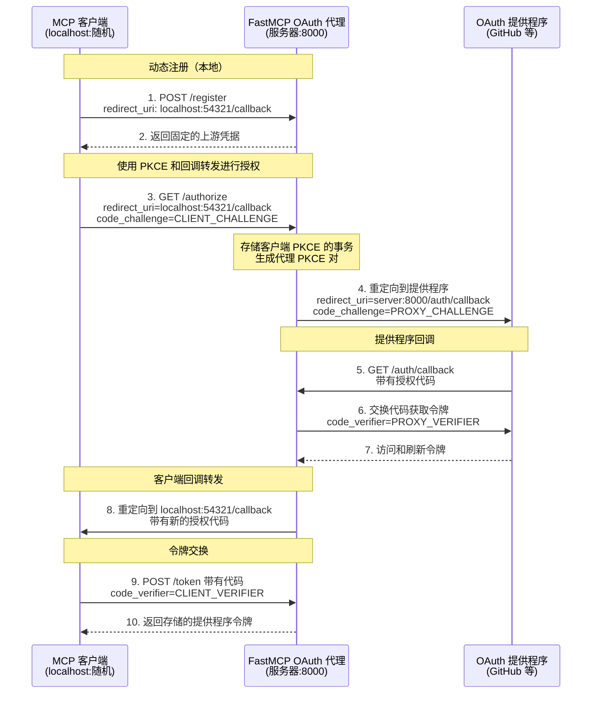

import { VersionBadge } from "/snippets/version-badge.mdx";

<VersionBadge version="2.12.0" />

OAuth 代理使 FastMCP 服务器能够与**不支持动态客户端注册 (DCR)** 的 OAuth 提供程序进行身份验证。这包括几乎所有传统 OAuth 提供程序：GitHub、Google、Azure、Discord、Facebook 和大多数企业身份系统。对于确实支持 DCR 的提供程序（如 WorkOS AuthKit），请使用 [`RemoteAuthProvider`](/zh/servers/auth/remote-oauth) 代替。

MCP 客户端期望自动注册并动态获取凭据，但传统提供程序需要通过其开发者控制台手动注册应用程序。OAuth 代理通过向 MCP 客户端提供符合 DCR 的接口同时使用您与上游提供程序的预注册凭据来弥合这一差距。当客户端尝试注册时，代理返回您的固定凭据。当客户端启动授权时，代理处理回调转发的复杂性——存储客户端的动态回调 URL，使用自己的固定回调与提供程序交互，然后在令牌交换后转发回客户端。

这种方法使任何 MCP 客户端（无论使用随机 localhost 端口还是固定 URL，如 Claude.ai）都能够与任何传统 OAuth 提供程序进行身份验证，同时保持完整的 OAuth 2.1 和 PKCE 安全性。

## 实现

### 提供程序设置要求

在使用 OAuth 代理之前，您需要在 OAuth 提供程序中注册您的应用程序：

1. **注册您的应用程序**在提供程序的开发者控制台中（GitHub 设置、Google Cloud 控制台、Azure 门户等）
2. **配置重定向 URI**为您的 FastMCP 服务器 URL 加上您选择的回调路径：
   - 默认：`https://your-server.com/auth/callback`
   - 自定义：`https://your-server.com/your/custom/path`（如果您设置了 `redirect_path`）
   - 开发：`http://localhost:8000/auth/callback`
3. **获取您的凭据**：客户端 ID 和客户端密钥
4. **记录 OAuth 端点**：授权 URL 和令牌 URL（通常在提供程序的 OAuth 文档中可以找到）

<Warning>
  您在提供程序中配置的重定向 URI 必须与您的
  FastMCP 服务器 URL 加上回调路径完全匹配。如果您在 OAuth 代理中
  自定义了 `redirect_path`，请相应地更新您提供程序的重定向 URI。
</Warning>

### 基本设置

以下是如何与任何提供程序实现 OAuth 代理：

```python
from fastmcp import FastMCP
from fastmcp.server.auth import OAuthProxy
from fastmcp.server.auth.providers.jwt import JWTVerifier

# 为您的提供程序配置令牌验证
# 有关特定提供程序的设置，请参阅令牌验证指南
token_verifier = JWTVerifier(
    jwks_uri="https://your-provider.com/.well-known/jwks.json",
    issuer="https://your-provider.com",
    audience="your-app-id"
)

# 创建 OAuth 代理
auth = OAuthProxy(
    # 提供程序的 OAuth 端点（来自其文档）
    upstream_authorization_endpoint="https://provider.com/oauth/authorize",
    upstream_token_endpoint="https://provider.com/oauth/token",

    # 您注册的应用凭据
    upstream_client_id="your-client-id",
    upstream_client_secret="your-client-secret",

    # 令牌验证（参阅令牌验证指南）
    token_verifier=token_verifier,

    # 您的 FastMCP 服务器的公共 URL
    base_url="https://your-server.com",

    # 可选：自定义回调路径（默认为 "/auth/callback"）
    # redirect_path="/custom/callback",
)

mcp = FastMCP(name="My Server", auth=auth)
```

### 配置参数

<Card icon="code" title="OAuthProxy 参数">
<ParamField body="upstream_authorization_endpoint" type="str" required>
  您的 OAuth 提供程序的授权端点 URL（例如，`https://github.com/login/oauth/authorize`）
</ParamField>

<ParamField body="upstream_token_endpoint" type="str" required>
  您的 OAuth 提供程序的令牌端点 URL（例如，`https://github.com/login/oauth/access_token`）
</ParamField>

<ParamField body="upstream_client_id" type="str" required>
  来自您注册的 OAuth 应用程序的客户端 ID
</ParamField>

<ParamField body="upstream_client_secret" type="str" required>
  来自您注册的 OAuth 应用程序的客户端密钥
</ParamField>

<ParamField body="token_verifier" type="TokenVerifier" required>
  用于验证提供程序令牌的 [`TokenVerifier`](/zh/servers/auth/token-verification) 实例
</ParamField>

<ParamField body="base_url" type="AnyHttpUrl | str" required>
  您的 FastMCP 服务器的公共 URL（例如，`https://your-server.com`）
</ParamField>

<ParamField body="redirect_path" type="str" default="/auth/callback">
  OAuth 回调的路径。必须与您在 OAuth 应用程序中配置的重定向 URI 匹配
</ParamField>

<ParamField body="upstream_revocation_endpoint" type="str | None">
  提供程序令牌撤销端点的可选 URL
</ParamField>

<ParamField body="issuer_url" type="AnyHttpUrl | str | None">
  OAuth 元数据的发行者 URL（默认为 base_url）
</ParamField>

<ParamField body="service_documentation_url" type="AnyHttpUrl | str | None">
  您服务文档的可选 URL
</ParamField>

<ParamField body="forward_pkce" type="bool" default="True">
  是否将 PKCE（代码交换证明密钥）转发到上游 OAuth 提供程序。启用后，当客户端使用 PKCE 时，代理会生成自己的 PKCE 参数发送到上游，同时单独验证客户端的 PKCE。这确保了在两个层面（客户端到代理和代理到上游）的端到端 PKCE 安全性。
  - `True`（默认）：为支持它的提供程序转发 PKCE（Google、Azure、GitHub 等）
  - `False`：仅在上游提供程序不支持 PKCE 时禁用
</ParamField>

<ParamField body="token_endpoint_auth_method" type="str | None">
  上游 OAuth 服务器的令牌端点身份验证方法。控制代理在与上游提供程序交换授权代码和刷新令牌时如何进行身份验证。
  - `"client_secret_basic"`：在 Authorization 头中发送凭据（最常见）
  - `"client_secret_post"`：在请求体中发送凭据（某些提供程序要求）
  - `"none"`：无身份验证（用于公共客户端）
  - `None`（默认）：使用 authlib 的默认值（通常为 `"client_secret_basic"`）

  如果您的提供程序需要特定的身份验证方法且默认方法不工作，请设置此选项。
</ParamField>

<ParamField body="allowed_client_redirect_uris" type="list[str] | None">
  MCP 客户端允许的重定向 URI 模式列表。模式支持通配符（例如，`"http://localhost:*"`、`"https://*.example.com/*"`）。
  - `None`（默认）：允许所有重定向 URI（用于 MCP/DCR 兼容性）
  - 空列表 `[]`：不允许任何重定向 URI
  - 自定义列表：仅允许匹配的模式

  这些模式适用于 MCP 客户端回环重定向，而不是上游 OAuth 应用的重定向 URI。
</ParamField>

<ParamField body="valid_scopes" type="list[str] | None">
  OAuth 提供程序的所有可能有效作用域列表。这些作用域通过 `/.well-known` 端点向客户端通告。如果未指定，默认为 TokenVerifier 中的 `required_scopes`。
</ParamField>
</Card>

### 使用内置提供程序

FastMCP 包含为常见服务预配置的提供程序：

```python
from fastmcp.server.auth.providers.github import GitHubProvider

auth = GitHubProvider(
    client_id="your-github-app-id",
    client_secret="your-github-app-secret",
    base_url="https://your-server.com"
)

mcp = FastMCP(name="My Server", auth=auth)
```

可用的提供程序包括 `GitHubProvider`、`GoogleProvider` 等。这些提供程序会自动处理令牌验证。

### 作用域配置

OAuth 作用域通过您的 `TokenVerifier` 进行配置。设置 `required_scopes` 以自动请求您的应用程序所需的权限：

```python
JWTVerifier(..., required_scopes = ["read:user", "write:data"])
```

代理创建的动态客户端将自动在其授权请求中包含这些作用域。

## 工作原理



上面的流程图说明了完整的 OAuth 代理模式。让我们了解每个阶段：

### 注册阶段

当 MCP 客户端使用其动态回调 URL 调用 `/register` 时，代理会使用您预配置的上游凭据进行响应。客户端存储这些凭据，认为它已经注册了一个新应用。同时，代理记录客户端的回调 URL 以供后续使用。

### 授权阶段

客户端通过重定向到代理的 `/authorize` 端点来启动 OAuth。代理：

1. 存储客户端的事务及其 PKCE 质询
2. 为上游安全生成自己的 PKCE 参数
3. 使用固定的回调 URL 重定向到上游提供程序

这种双 PKCE 方法在客户端到代理和代理到提供程序层面都保持端到端安全性。

### 回调阶段

在用户授权后，提供程序重定向回代理的固定回调 URL。代理：

1. 与提供程序交换授权代码获取令牌
2. 临时存储这些令牌
3. 为客户端生成新的授权代码
4. 重定向到客户端的原始动态回调 URL

### 令牌交换阶段

最后，客户端与代理交换其授权代码以接收提供程序的令牌。代理在返回存储的令牌之前验证客户端的 PKCE 验证器。

整个流程对 MCP 客户端是透明的——它体验到的是带有动态注册的标准 OAuth 流程，不知道代理正在幕后管理复杂性。

### PKCE 转发

OAuth 代理在与支持或需要 PKCE 的提供程序工作时会自动处理 PKCE（代码交换证明密钥）。代理生成自己的 PKCE 参数发送到上游，同时单独验证客户端的 PKCE，确保两个层面的端到端安全性。

这通过 `forward_pkce` 参数默认启用，与 Google、Azure AD 和 GitHub 等提供程序无缝工作。仅在不支持 PKCE 的传统提供程序上禁用它：

```python
# 仅在上游不支持 PKCE 时禁用 PKCE 转发
auth = OAuthProxy(
    ...,
    forward_pkce=False  # 默认为 True
)
```

### 重定向 URI 验证

虽然 OAuth 代理默认接受所有重定向 URI（为了 DCR 兼容性），但您可以通过指定允许的模式来限制哪些客户端可以连接：

```python
# 仅允许 localhost 客户端（开发中常见）
auth = OAuthProxy(
    # ... 其他参数 ...
    allowed_client_redirect_uris=[
        "http://localhost:*",
        "http://127.0.0.1:*"
    ]
)

# 允许特定的已知客户端
auth = OAuthProxy(
    # ... 其他参数 ...
    allowed_client_redirect_uris=[
        "http://localhost:*",
        "https://claude.ai/api/mcp/auth_callback",
        "https://*.mycompany.com/auth/*"  # 支持通配符模式
    ]
)
```

检查服务器日志中的“客户端使用 redirect_uri 注册”消息，以确定您的客户端使用的 URL。

## 令牌验证

OAuth 代理需要兼容的 `TokenVerifier` 来验证来自您提供程序的令牌。不同的提供程序使用不同的令牌格式：

- **JWT 令牌**（Google、Azure）：使用 `JWTVerifier` 与提供程序的 JWKS 端点
- **不透明令牌**（GitHub、Discord）：使用特定于提供程序的验证器或实现自定义验证

有关您提供程序的详细设置说明，请参阅[令牌验证指南](/zh/servers/auth/token-verification)。

## 环境配置

<VersionBadge version="2.12.1" />

对于生产部署，通过环境变量配置 OAuth 代理，而不是硬编码凭据：

```bash
# 指定提供程序实现
export FASTMCP_SERVER_AUTH=fastmcp.server.auth.providers.github.GitHubProvider

# 特定于提供程序的凭据
export FASTMCP_SERVER_AUTH_GITHUB_CLIENT_ID="Ov23li..."
export FASTMCP_SERVER_AUTH_GITHUB_CLIENT_SECRET="abc123..."
export FASTMCP_SERVER_AUTH_GITHUB_BASE_URL="https://your-production-server.com"
```

使用环境配置，您的服务器代码简化为：

```python
from fastmcp import FastMCP

# 身份验证自动从环境中配置
mcp = FastMCP(name="My Server")

@mcp.tool
def protected_tool(data: str) -> str:
    """此工具现在受 OAuth 保护。"""
    return f"已处理：{data}"

if __name__ == "__main__":
    mcp.run(transport="http", port=8000)
```
