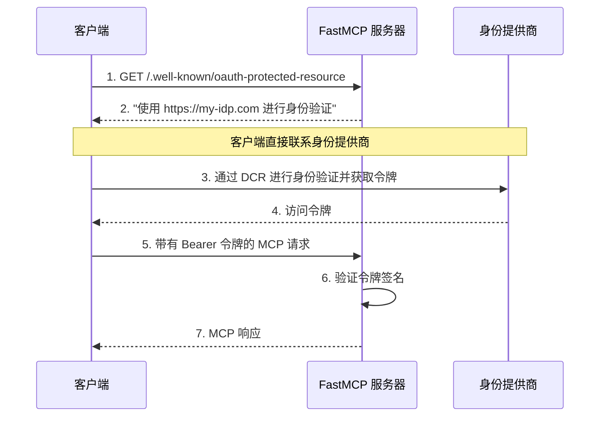

import { VersionBadge } from "/snippets/version-badge.mdx"

<VersionBadge version="2.11.0" />

远程 OAuth 集成允许你的 FastMCP 服务器利用 **支持动态客户端注册（DCR）** 的外部身份提供者。通过 DCR，MCP 客户端可以自动向身份提供者注册自身并获取凭证，无需任何手动配置。这提供了企业级认证和全自动化流程，非常适合使用现代身份提供者的生产环境应用。

<Tip>
**何时使用 RemoteAuthProvider 与 OAuth Proxy:**
- **RemoteAuthProvider**: 用于支持动态客户端注册的提供者（如 WorkOS AuthKit、现代 OIDC 提供者）
- **OAuth Proxy**: 用于不支持动态客户端注册的提供者（如 GitHub、Google、Azure、Discord 等）

RemoteAuthProvider 需要 DCR 支持，以实现客户端的完全自动化注册和认证。
</Tip>

## 支持 DCR 的提供商

RemoteAuthProvider 与支持**动态客户端注册（DCR）**的身份提供商配合使用 - 这是一项启用自动化身份验证流程的关键功能：

| 功能 | DCR 提供商（RemoteAuth）| 非 DCR 提供商（OAuth 代理）|
|---------|---------------------------|--------------------------------|
| **客户端注册** | 通过 API 自动注册 | 在提供商控制台手动注册 |
| **凭据** | 每个客户端动态生成 | 固定的应用凭据 |
| **配置** | 零客户端配置 | 预共享凭据 |
| **示例** | WorkOS AuthKit，现代 OIDC | GitHub，Google，Azure |
| **FastMCP 类** | `RemoteAuthProvider` | [`OAuthProxy`](/zh/servers/auth/oauth-proxy) |

如果您的提供商不支持 DCR（大多数传统的 OAuth 提供商），您需要使用 [`OAuth 代理`](/zh/servers/auth/oauth-proxy) 代替，它弥合了 MCP 的 DCR 期望与固定 OAuth 凭据之间的差距。

## 远程 OAuth 挑战

传统的 OAuth 流程假设有使用网络浏览器的人类用户，可以与登录表单、同意屏幕和重定向进行交互。MCP 客户端的运行方式不同——它们通常是需要在无人干预的情况下以编程方式进行身份验证的自动化系统。

这产生了几个标准 OAuth 实现无法很好解决的独特要求：

**自动发现**：MCP 客户端必须通过检查服务器元数据来发现身份验证要求，而不是遇到 HTTP 重定向。它们需要在发出任何经过身份验证的请求之前知道要使用哪个身份提供商以及如何访问它。

**编程式注册**：客户端需要自动向身份提供商注册自己。当客户端可能是动态创建的工具或服务时，手动客户端注册不起作用。

**无缝令牌管理**：客户端必须在没有用户交互的情况下获取、存储和刷新令牌。身份验证流程需要在没有人类可用来完成 OAuth 同意流程的无头环境中工作。

**协议集成**：身份验证过程必须与 MCP 的 JSON-RPC 传输层和错误处理机制清晰地集成。

这些要求意味着您的 MCP 服务器需要做的不仅仅是验证令牌——它需要提供发现元数据，使 MCP 客户端能够自动理解和导航您的身份验证要求。

## MCP 身份验证发现

MCP 身份验证发现依赖于客户端可以检查的已知端点来理解您的身份验证要求。您的服务器成为 MCP 客户端和您选择的身份提供商之间的桥梁。

核心发现端点是 `/.well-known/oauth-protected-resource`，它告诉客户端您的服务器需要 OAuth 身份验证，并标识您信任的授权服务器。此端点包含静态元数据，将客户端指向您的身份提供商，而无需任何动态查找。



这个流程清晰地分离了关注点：您的 MCP 服务器处理资源保护和令牌验证，而您的身份提供商处理用户身份验证和令牌发行。客户端使用标准化的 OAuth 发现机制在这些系统之间进行协调。

## FastMCP 远程身份验证

<VersionBadge version="2.11.1" />

FastMCP 提供 `RemoteAuthProvider` 来处理远程 OAuth 集成的复杂性。此类将令牌验证功能与 MCP 客户端所需的 OAuth 发现元数据相结合。

### 远程身份提供者(RemoteAuthProvider)

`RemoteAuthProvider` 通过将 [`TokenVerifier`](/zh/servers/auth/token-verification) 与授权服务器信息组合来工作。`TokenVerifier` 是另一个专注于令牌验证的 FastMCP 身份验证类——签名验证、过期检查和声明提取。`RemoteAuthProvider` 利用该令牌验证功能并添加 OAuth 发现端点，使 MCP 客户端能够自动找到您的身份提供商并进行身份验证。

这种组合模式意味着您可以使用任何令牌验证策略（JWT 验证、内省端点、自定义验证逻辑），同时保持一致的 OAuth 发现行为。这种分离允许您更改令牌验证方法而不影响客户端发现体验。

该类使用 MCP SDK 的标准化路由创建函数自动生成所需的 OAuth 元数据端点。这确保了与 MCP 客户端的兼容性，同时降低了服务器开发人员的实现复杂性。

### 基本实现

大多数应用程序可以直接使用 `RemoteAuthProvider` 而无需子类化。实现需要一个 `TokenVerifier` 实例、一个受信任的授权服务器列表，以及您的服务器的 URL 用于元数据生成。

```python
from fastmcp import FastMCP
from fastmcp.server.auth import RemoteAuthProvider
from fastmcp.server.auth.providers.jwt import JWTVerifier
from pydantic import AnyHttpUrl

# Configure token validation for your identity provider
token_verifier = JWTVerifier(
    jwks_uri="https://auth.yourcompany.com/.well-known/jwks.json",
    issuer="https://auth.yourcompany.com",
    audience="mcp-production-api"
)

# Create the remote auth provider
auth = RemoteAuthProvider(
    token_verifier=token_verifier,
    authorization_servers=[AnyHttpUrl("https://auth.yourcompany.com")],
    base_url="https://api.yourcompany.com",  # Your server base URL
    # Optional: customize allowed client redirect URIs (defaults to localhost only)
    allowed_client_redirect_uris=["http://localhost:*", "http://127.0.0.1:*"]
)

mcp = FastMCP(name="Company API", auth=auth)
```

此配置创建一个接受由 `auth.yourcompany.com` 发行的令牌的服务器，并提供 MCP 客户端所需的 OAuth 发现元数据。`JWTVerifier` 使用您的身份提供商的公钥处理令牌验证，而 `RemoteAuthProvider` 生成所需的 OAuth 端点。

The `authorization_servers` list tells MCP clients which identity providers you trust. The `base_url` identifies your server in OAuth metadata, enabling proper token audience validation. **Important**: The `base_url` should point to your server base URL - for example, if your MCP server is accessible at `https://api.yourcompany.com/mcp`, use `https://api.yourcompany.com` as the base URL.

### 自定义端点

您可以扩展 `RemoteAuthProvider` 以添加标准 OAuth 受保护资源元数据之外的其他端点。这些不必是 OAuth 特定的——您可以添加身份验证集成所需的任何端点。

```python
import httpx
from starlette.responses import JSONResponse
from starlette.routing import Route

class CompanyAuthProvider(RemoteAuthProvider):
    def __init__(self):
        token_verifier = JWTVerifier(
            jwks_uri="https://auth.yourcompany.com/.well-known/jwks.json",
            issuer="https://auth.yourcompany.com",
            audience="mcp-production-api"
        )
        
        super().__init__(
            token_verifier=token_verifier,
            authorization_servers=[AnyHttpUrl("https://auth.yourcompany.com")],
            base_url="https://api.yourcompany.com"  # Your server base URL
        )
    
    def get_routes(self) -> list[Route]:
        """将自定义端点添加到标准受保护资源路由中。"""
        
        # 获取标准 OAuth 受保护资源路由
        routes = super().get_routes()
        
        # 为客户端便利添加授权服务器元数据转发
        async def authorization_server_metadata(request):
            async with httpx.AsyncClient() as client:
                response = await client.get(
                    "https://auth.yourcompany.com/.well-known/oauth-authorization-server"
                )
                response.raise_for_status()
                return JSONResponse(response.json())
        
        routes.append(
            Route("/.well-known/oauth-authorization-server", authorization_server_metadata)
        )
        
        return routes

mcp = FastMCP(name="公司 API", auth=CompanyAuthProvider())
```

这种模式使用 `super().get_routes()` 获取标准受保护资源路由，然后根据需要添加其他端点。一个常见的用例是提供授权服务器元数据转发，这允许 MCP 客户端通过您的 MCP 服务器发现您的身份提供商的功能，而不是直接联系身份提供商。

## WorkOS AuthKit 集成

WorkOS AuthKit 提供了远程 OAuth 集成的绝佳示例。`AuthKitProvider` 演示了如何在生产就绪的包中实现令牌验证和 OAuth 元数据转发。

```python
from fastmcp import FastMCP
from fastmcp.server.auth.providers.workos import AuthKitProvider

auth = AuthKitProvider(
    authkit_domain="https://your-project.authkit.app",
    base_url="https://your-mcp-server.com"
)

mcp = FastMCP(name="受保护的应用程序", auth=auth)
```

`AuthKitProvider` 自动配置针对 WorkOS 公钥的 JWT 验证，并提供受保护资源元数据和授权服务器元数据转发。此实现以最少的配置处理完整的远程 OAuth 集成。

WorkOS 对动态客户端注册的支持使其特别适合 MCP 应用程序。客户端可以自动向您的 WorkOS 项目注册自己，并获得身份验证所需的凭据，无需手动干预。

→ **完整 WorkOS 教程**：[AuthKit 集成指南](/zh/integrations/authkit)

## Client Redirect URI Security

<Note>
`RemoteAuthProvider` also supports the `allowed_client_redirect_uris` parameter for controlling which redirect URIs are accepted from MCP clients during DCR:

- `None` (default): Only localhost patterns allowed
- Custom list: Specify allowed patterns with wildcard support
- Empty list `[]`: Allow all (not recommended)

This provides defense-in-depth even though DCR providers typically validate redirect URIs themselves.
</Note>

## 实现考虑因素

远程 OAuth 集成需要仔细关注影响可靠性和安全性的几个技术细节。

**令牌验证性能**：您的服务器通过检查您的身份提供商的公钥签名来验证每个传入的令牌。考虑实现密钥缓存和轮换处理以最小化延迟，同时保持安全性。

**错误处理**：与您的身份提供商的网络问题可能影响令牌验证。实现适当的超时、重试逻辑和优雅降级，以在身份提供商中断期间维持服务可用性。

**受众验证**：确保专为您的服务器设计的令牌不被其他应用程序接受。适当的受众验证防止令牌在您的生态系统中的不同服务间被滥用。

**范围管理**：将令牌范围一致地映射到您的应用程序的权限模型。考虑范围更改如何影响现有令牌，并计划平滑的权限更新。

这些考虑因素的复杂性强化了为什么推荐使用外部身份提供商而不是自定义 OAuth 实现。成熟的提供商通过广泛的测试和运营经验处理这些技术细节。