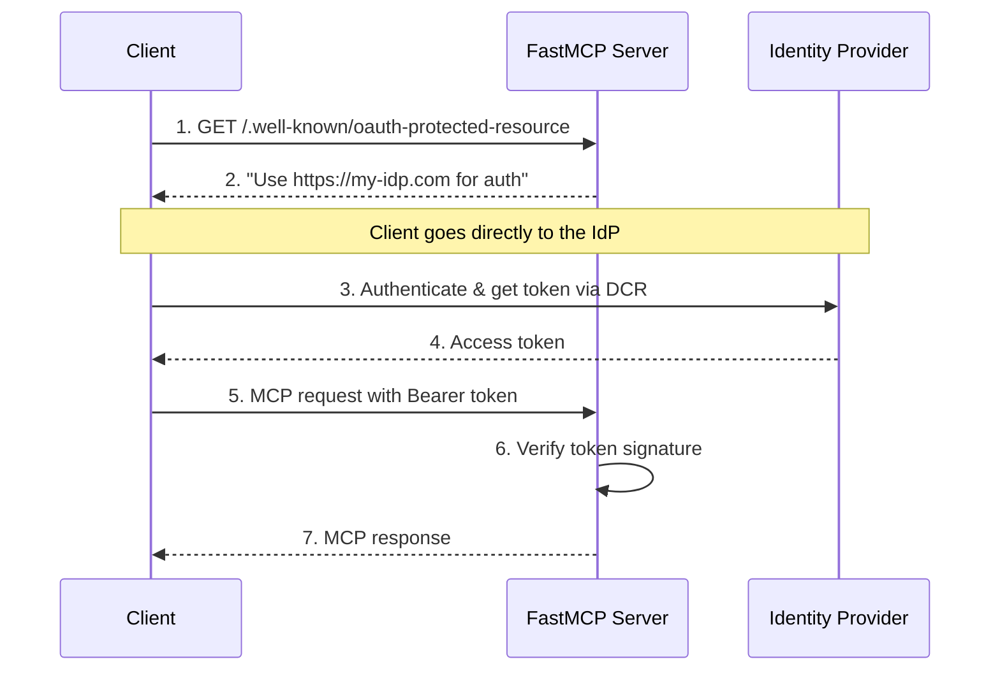

import { VersionBadge } from "/snippets/version-badge.mdx"

<VersionBadge version="2.11.0" />

Remote OAuth 集成允许您的 FastMCP 服务器利用**支持动态客户端注册（DCR）**的外部身份提供商。通过 DCR，MCP 客户端可以自动向身份提供商注册自己并获取凭据，无需任何手动配置。这提供了企业级身份验证和完全自动化的流程，使其成为具有现代身份提供商的生产应用程序的理想选择。

<Tip>
**何时使用 RemoteAuthProvider vs OAuth 代理：**
- **RemoteAuthProvider**：用于支持动态客户端注册的提供商（Descope、WorkOS AuthKit、现代 OIDC 提供商）
- **OAuth 代理**：用于不支持动态客户端注册的提供商（GitHub、Google、Azure、AWS、Discord 等）

RemoteAuthProvider 需要 DCR 支持才能实现完全自动化的客户端注册和身份验证。
</Tip>

## 支持 DCR 的提供商

RemoteAuthProvider 适用于支持**动态客户端注册（DCR）**的身份提供商——这是一个实现自动化身份验证流程的关键能力：

| 功能 | DCR 提供商（RemoteAuth） | 非 DCR 提供商（OAuth 代理） |
|---------|---------------------------|--------------------------------|
| **客户端注册** | 通过 API 自动 | 在提供商控制台中手动 |
| **凭据** | 每个客户端动态 | 固定的应用程序凭据 |
| **配置** | 零客户端配置 | 预共享凭据 |
| **示例** | Descope、WorkOS AuthKit、现代 OIDC | GitHub、Google、Azure |
| **FastMCP 类** | `RemoteAuthProvider` | [`OAuthProxy`](/zh/servers/auth/oauth-proxy) |

如果您的提供商不支持 DCR（大多数传统 OAuth 提供商），您需要改用 [`OAuth 代理`](/zh/servers/auth/oauth-proxy)，它在 MCP 的 DCR 期望和固定 OAuth 凭据之间建立桥梁。

## Remote OAuth 挑战

传统的 OAuth 流程假设有网页浏览器的真人用户可以与登录表单、同意屏幕和重定向进行交互。MCP 客户端的运作方式不同——它们通常是自动化系统，需要以编程方式进行身份验证，无需人工干预。

这产生了一些标准 OAuth 实现无法很好解决的独特需求：

**自动发现**：MCP 客户端必须通过检查服务器元数据来发现身份验证要求，而不是遇到 HTTP 重定向。它们需要知道使用哪个身份提供商以及如何在发出任何经过身份验证的请求之前联系它。

**编程注册**：客户端需要自动向身份提供商注册自己。当客户端可能是动态创建的工具或服务时，手动客户端注册无法工作。

**无缝令牌管理**：客户端必须获取、存储和刷新令牌，无需用户交互。身份验证流程需要在无头环境中工作，在这种环境中没有人来完成 OAuth 同意流程。

**协议集成**：身份验证过程必须与 MCP 的 JSON-RPC 传输层和错误处理机制干净地集成。

这些需求意味着您的 MCP 服务器需要做的不仅仅是验证令牌——它还需要提供发现元数据，使 MCP 客户端能够自动理解和导航您的身份验证要求。

## MCP 身份验证发现

MCP 身份验证发现依赖于众所周知的端点，客户端可以检查这些端点以了解您的身份验证要求。您的服务器成为 MCP 客户端和您选择的身份提供商之间的桥梁。

核心发现端点是 `/.well-known/oauth-protected-resource`，它告诉客户端您的服务器需要 OAuth 身份验证并标识您信任的授权服务器。此端点包含指向客户端身份提供商的静态元数据，无需任何动态查找。



这个流程干净地分离了关注点：您的 MCP 服务器处理资源保护和令牌验证，而您的身份提供商处理用户身份验证和令牌颁发。客户端使用标准化的 OAuth 发现机制在这些系统之间进行协调。

## FastMCP Remote 身份验证

<VersionBadge version="2.11.1" />

FastMCP 提供 `RemoteAuthProvider` 来处理远程 OAuth 集成的复杂性。此类将令牌验证功能与 MCP 客户端所需的 OAuth 发现元数据结合起来。

### RemoteAuthProvider

`RemoteAuthProvider` 通过将 [`TokenVerifier`](/zh/servers/auth/token-verification) 与授权服务器信息组合来工作。`TokenVerifier` 是另一个专注于令牌验证的 FastMCP 身份验证类——签名验证、过期检查和声明提取。`RemoteAuthProvider` 获取该令牌验证功能并添加使 MCP 客户端能够自动找到并使用您的身份提供商进行身份验证的 OAuth 发现端点。

这种组合模式意味着您可以使用任何令牌验证策略，同时保持一致的 OAuth 发现行为：
- **JWT 令牌**：使用 `JWTVerifier` 处理自包含令牌
- **不透明令牌**：使用 `IntrospectionTokenVerifier` 进行 RFC 7662 内省
- **自定义验证**：实现您自己的 `TokenVerifier` 子类

这种分离允许您更改令牌验证方法而不影响客户端发现体验。

该类使用 MCP SDK 的标准化路由创建函数自动生成所需的 OAuth 元数据端点。这确保了与 MCP 客户端的兼容性，同时降低了服务器开发者的实现复杂性。

### 基本实现

大多数应用程序可以直接使用 `RemoteAuthProvider` 而无需子类化。实现需要一个 `TokenVerifier` 实例、受信任的授权服务器列表以及用于元数据生成的服务器 URL。

```python
from fastmcp import FastMCP
from fastmcp.server.auth import RemoteAuthProvider
from fastmcp.server.auth.providers.jwt import JWTVerifier
from pydantic import AnyHttpUrl

# 为您的身份提供商配置令牌验证
token_verifier = JWTVerifier(
    jwks_uri="https://auth.yourcompany.com/.well-known/jwks.json",
    issuer="https://auth.yourcompany.com",
    audience="mcp-production-api"
)

# 创建远程身份验证提供商
auth = RemoteAuthProvider(
    token_verifier=token_verifier,
    authorization_servers=[AnyHttpUrl("https://auth.yourcompany.com")],
    base_url="https://api.yourcompany.com",  # 您的服务器基本 URL
    # 可选：自定义允许的客户端重定向 URI（默认仅允许 localhost）
    allowed_client_redirect_uris=["http://localhost:*", "http://127.0.0.1:*"]
)

mcp = FastMCP(name="Company API", auth=auth)
```

此配置创建了一个接受由 `auth.yourcompany.com` 颁发的令牌的服务器，并提供 MCP 客户端所需的 OAuth 发现元数据。`JWTVerifier` 使用您身份提供商的公钥处理令牌验证，而 `RemoteAuthProvider` 生成所需的 OAuth 端点。

`authorization_servers` 列表告诉 MCP 客户端您信任哪些身份提供商。`base_url` 在 OAuth 元数据中标识您的服务器，实现正确的令牌受众验证。**重要提示**：`base_url` 应指向您的服务器基本 URL——例如，如果您的 MCP 服务器可在 `https://api.yourcompany.com/mcp` 访问，请使用 `https://api.yourcompany.com` 作为基本 URL。

### 自定义端点

您可以扩展 `RemoteAuthProvider` 以添加超出标准 OAuth 受保护资源元数据的其他端点。这些端点不必是 OAuth 特定的——您可以添加身份验证集成所需的任何端点。

```python
import httpx
from starlette.responses import JSONResponse
from starlette.routing import Route

class CompanyAuthProvider(RemoteAuthProvider):
    def __init__(self):
        token_verifier = JWTVerifier(
            jwks_uri="https://auth.yourcompany.com/.well-known/jwks.json",
            issuer="https://auth.yourcompany.com",
            audience="mcp-production-api"
        )

        super().__init__(
            token_verifier=token_verifier,
            authorization_servers=[AnyHttpUrl("https://auth.yourcompany.com")],
            base_url="https://api.yourcompany.com"  # 您的服务器基本 URL
        )

    def get_routes(self) -> list[Route]:
        """向标准受保护资源路由添加自定义端点。"""

        # 获取标准 OAuth 受保护资源路由
        routes = super().get_routes()

        # 为客户端便利性添加授权服务器元数据转发
        async def authorization_server_metadata(request):
            async with httpx.AsyncClient() as client:
                response = await client.get(
                    "https://auth.yourcompany.com/.well-known/oauth-authorization-server"
                )
                response.raise_for_status()
                return JSONResponse(response.json())

        routes.append(
            Route("/.well-known/oauth-authorization-server", authorization_server_metadata)
        )

        return routes

mcp = FastMCP(name="Company API", auth=CompanyAuthProvider())
```

此模式使用 `super().get_routes()` 获取标准受保护资源路由，然后根据需要添加其他端点。一个常见的用例是提供授权服务器元数据转发，这允许 MCP 客户端通过您的 MCP 服务器发现您的身份提供商的功能，而不是直接联系身份提供商。

## WorkOS AuthKit 集成

WorkOS AuthKit 提供了远程 OAuth 集成的绝佳示例。`AuthKitProvider` 演示了如何在生产就绪的包中实现令牌验证和 OAuth 元数据转发。

```python
from fastmcp import FastMCP
from fastmcp.server.auth.providers.workos import AuthKitProvider

auth = AuthKitProvider(
    authkit_domain="https://your-project.authkit.app",
    base_url="https://your-mcp-server.com"
)

mcp = FastMCP(name="Protected Application", auth=auth)
```

`AuthKitProvider` 自动配置针对 WorkOS 公钥的 JWT 验证，并提供受保护资源元数据和授权服务器元数据转发。此实现以最少的配置处理完整的远程 OAuth 集成。

WorkOS 对动态客户端注册的支持使其特别适合 MCP 应用程序。客户端可以自动向您的 WorkOS 项目注册并获取身份验证所需的凭据，无需人工干预。

→ **完整的 WorkOS 教程**：[AuthKit 集成指南](/zh/integrations/authkit)

## 客户端重定向 URI 安全性

<Note>
`RemoteAuthProvider` 还支持 `allowed_client_redirect_uris` 参数，用于控制在 DCR 期间接受来自 MCP 客户端的哪些重定向 URI：

- `None`（默认）：仅允许 localhost 模式
- 自定义列表：指定允许的通配符支持模式
- 空列表 `[]`：允许所有（不推荐）

这提供了纵深防御，即使 DCR 提供商通常自己验证重定向 URI。
</Note>

## 实现注意事项

Remote OAuth 集成需要仔细关注几个影响可靠性和安全性的技术细节。

**令牌验证性能**：您的服务器通过检查与身份提供商公钥的签名来验证每个传入令牌。考虑实现密钥缓存和轮换处理，以在保持安全的同时最小化延迟。

**错误处理**：与身份提供商的网络问题可能影响令牌验证。实现适当的超时、重试逻辑和优雅降级，以在身份提供商停机期间保持服务可用性。

**受众验证**：确保用于您服务器的令牌不被其他应用程序接受。适当的受众验证可防止令牌在生态系统中的不同服务之间被误用。

**范围管理**：将令牌范围一致地映射到应用程序的权限模型。考虑范围变化如何影响现有令牌，并规划平滑的权限更新。

这些考虑的复杂性强化了为什么推荐外部身份提供商而不是自定义 OAuth 实现。成熟的提供商通过广泛的测试和运营经验来处理这些技术细节。