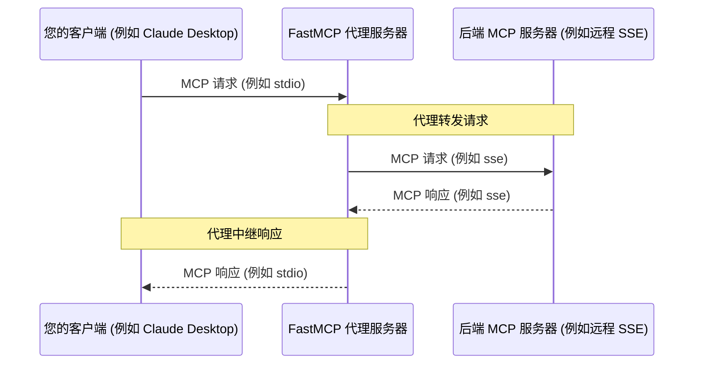

import { VersionBadge } from '/snippets/version-badge.mdx'

<VersionBadge version="2.0.0" />

FastMCP 提供了强大的代理功能，允许一个 FastMCP 服务器实例充当另一个 MCP 服务器的前端（该服务器可能是远程的、在不同链路系统上运行的，甚至是另一个 FastMCP 实例）。这通过 `FastMCP.as_proxy()` 类方法实现。

## 什么是代理？

代理意味着设置一个不直接实现自己的工具或资源的 FastMCP 服务器。相反，当它接收到请求（如 `tools/call` 或 `resources/read`）时，它将该请求转发到*后端* MCP 服务器，接收响应，然后将该响应中继回原始客户端。



### 主要优势

<VersionBadge version="2.10.3" />

- **会话隔离**：每个请求都有自己的隔离会话，确保安全的并发操作
- **传输桥接**：通过不同的传输方式暴露在一种链路上运行的服务器
- **高级 MCP 功能**：自动转发采样、征询、日志记录和进度
- **安全性**：充当后端服务器的受控网关
- **简单性**：即使后端位置或传输发生变化，仍然是单一端点

### 性能考虑

使用代理服务器时，特别是连接到基于 HTTP 的后端服务器时，需要注意延迟可能很显著。像 `list_tools()` 这样的操作可能需要数百毫秒，而本地工具只需要 1-2ms。挂载代理服务器时，这种延迟会影响父服务器上的所有操作，而不仅仅是与代理工具的交互。

如果低延迟是您用例的要求，请考虑使用 [`import_server()`](/zh/servers/composition#importing-static-composition) 在启动时复制工具，而不是在运行时代理它们。

## 快速开始

<VersionBadge version="2.10.3" />

创建代理的推荐方式是使用 `ProxyClient`，它提供完整的 MCP 功能支持和自动会话隔离：

```python
from fastmcp import FastMCP
from fastmcp.server.proxy import ProxyClient

# 创建具有完整 MCP 功能支持的代理
proxy = FastMCP.as_proxy(
    ProxyClient("backend_server.py"),
    name="MyProxy"
)

# 运行代理（例如，通过 stdio 用于 Claude Desktop）
if __name__ == "__main__":
    proxy.run()
```

这个单一设置为您提供：
- 安全的并发请求处理
- 高级 MCP 功能的自动转发（采样、征询等）
- 会话隔离以防止上下文混合
- 与所有 MCP 客户端的完全兼容性

您还可以将 FastMCP [客户端传输](/zh/clients/transports)（或可以推断为传输的参数）传递给 `as_proxy()`。这将自动为您创建一个 `ProxyClient` 实例。

最后，您可以将常规的 FastMCP `Client` 实例传递给 `as_proxy()`。这适用于许多用例，但如果服务器调用采样或征询等高级 MCP 功能，可能会出现问题。 

## 会话隔离和并发

<VersionBadge version="2.10.3" />

FastMCP 代理提供会话隔离以确保安全的并发操作。会话策略取决于代理的配置方式：

### 新鲜会话

当您传递一个断开连接的客户端（这是正常情况）时，每个请求都会获得自己的隔离后端会话：

```python
from fastmcp.server.proxy import ProxyClient

# 每个请求创建一个新的后端会话（推荐）
proxy = FastMCP.as_proxy(ProxyClient("backend_server.py"))

# 多个客户端可以同时使用此代理而不会相互干扰：
# - 客户端 A 调用工具 -> 获得隔离的后端会话
# - 客户端 B 调用工具 -> 获得不同的隔离后端会话
# - 请求之间没有上下文混合
```

### 与已连接客户端的会话重用

当您传递一个已连接的客户端时，代理将为所有请求重用该会话：

```python
from fastmcp import Client

# 创建并连接客户端
async with Client("backend_server.py") as connected_client:
    # 此代理将为所有请求重用连接的会话
    proxy = FastMCP.as_proxy(connected_client)
    
    # ⚠️ 警告：所有请求共享相同的后端会话
    # 这可能在并发场景中导致上下文混合
```

**重要**：在来自多个客户端的并发请求中使用共享会话可能导致上下文混合和竞态条件。这种方法只应在单线程场景中或当您有显式同步时使用。

## 传输桥接

一个常见的用例是桥接传输 - 通过不同的传输方式暴露在一种传输上运行的服务器。例如，通过 stdio 在本地提供远程 SSE 服务器：

```python
from fastmcp import FastMCP
from fastmcp.server.proxy import ProxyClient

# 将远程 SSE 服务器桥接到本地 stdio
remote_proxy = FastMCP.as_proxy(
    ProxyClient("http://example.com/mcp/sse"),
    name="Remote-to-Local Bridge"
)

# 通过 stdio 在本地运行，用于 Claude Desktop
if __name__ == "__main__":
    remote_proxy.run()  # 默认为 stdio 传输
```

或者通过 HTTP 暴露本地服务器进行远程访问：

```python
# 将本地服务器桥接到 HTTP
local_proxy = FastMCP.as_proxy(
    ProxyClient("local_server.py"),
    name="Local-to-HTTP Bridge"
)

# 通过 HTTP 运行，供远程客户端使用
if __name__ == "__main__":
    local_proxy.run(transport="http", host="0.0.0.0", port=8080)
```


## 高级 MCP 功能

<VersionBadge version="2.10.3" />

`ProxyClient` 在后端服务器和连接到代理的客户端之间自动转发高级 MCP 协议功能，确保完整的 MCP 兼容性。

### 支持的功能

- **根目录**：将文件系统根访问请求转发给客户端
- **采样**：将来自后端的 LLM 完成请求转发给客户端
- **征询**：将用户输入请求转发给客户端
- **日志记录**：将来自后端的日志消息转发给客户端
- **进度**：在长时间操作期间转发进度通知

```python
from fastmcp.server.proxy import ProxyClient

# ProxyClient 自动处理所有这些功能
backend = ProxyClient("advanced_backend.py")
proxy = FastMCP.as_proxy(backend)

# 当后端服务器：
# - 请求 LLM 采样 -> 转发到您的客户端
# - 记录消息 -> 出现在您的客户端中
# - 报告进度 -> 显示在您的客户端中
# - 需要用户输入 -> 提示您的客户端
```

### 自定义功能支持

您可以通过为特定处理程序传递 `None` 来选择性地禁用转发：

```python
# 禁用采样但保留其他功能
backend = ProxyClient(
    "backend_server.py",
    sampling_handler=None,  # 禁用 LLM 采样转发
    log_handler=None        # 禁用日志转发
)
```

当您直接在 `FastMCP.as_proxy()` 中使用传输字符串时，它会在内部自动创建一个 `ProxyClient` 以确保完整的功能支持。

## 基于配置的代理

<VersionBadge version="2.4.0" />

您可以直接从遵循 MCPConfig 架构的配置字典创建代理。这对于快速设置到远程服务器的代理而无需手动配置每个连接详细信息非常有用。

```python
from fastmcp import FastMCP

# 直接从配置字典创建代理
config = {
    "mcpServers": {
        "default": {  # 对于单服务器配置，通常使用 'default'
            "url": "https://example.com/mcp",
            "transport": "http"
        }
    }
}

# 创建到配置服务器的代理（自动创建 ProxyClient）
proxy = FastMCP.as_proxy(config, name="Config-Based Proxy")

# 使用 stdio 传输运行代理进行本地访问
if __name__ == "__main__":
    proxy.run()
```

<Note>
MCPConfig 格式遵循 MCP 服务器配置的新兴标准，可能会随着规范的成熟而发展。虽然 FastMCP 旨在保持与未来版本的兼容性，但请注意字段名称或结构可能会发生变化。
</Note>

### 多服务器配置

您可以通过在配置中指定多个条目来创建到多个服务器的代理。它们会自动以其配置名称作为前缀进行挂载：

```python
# 多服务器配置
config = {
    "mcpServers": {
        "weather": {
            "url": "https://weather-api.example.com/mcp",
            "transport": "http"
        },
        "calendar": {
            "url": "https://calendar-api.example.com/mcp",
            "transport": "http"
        }
    }
}

# 创建到多个服务器的统一代理
composite_proxy = FastMCP.as_proxy(config, name="Composite Proxy")

# 工具、资源、提示和模板可通过前缀访问：
# - 工具: weather_get_forecast, calendar_add_event
# - 提示: weather_daily_summary, calendar_quick_add
# - 资源: weather://weather/icons/sunny, calendar://calendar/events/today
# - 模板: weather://weather/locations/{id}, calendar://calendar/events/{date}
```

## 组件前缀

代理一个或多个服务器时，组件名称的前缀方式与挂载和导入相同：

- 工具：`{prefix}_{tool_name}`
- 提示：`{prefix}_{prompt_name}`
- 资源：`protocol://{prefix}/path/to/resource`（默认路径格式）
- 资源模板：`protocol://{prefix}/...` 且模板名称也会添加前缀

这些规则适用于以下所有情况：
- 在另一个服务器上挂载代理
- 从`MCPConfig`创建多服务器代理
- 直接使用`FastMCP.as_proxy()`

有关资源URI前缀格式（路径vs传统协议样式）和配置选项，请参阅服务器组合 → 资源前缀格式。

## 镜像组件

<VersionBadge version="2.10.5" />

当您从代理服务器访问工具、资源或提示时，它们是从远程服务器"镜像"的。镜像组件不能直接修改，因为它们反映了远程服务器的状态。例如，您不能简单地"禁用"镜像组件。

但是，您可以创建镜像组件的副本，并将其存储为新的本地定义组件。本地组件始终优先于镜像组件，因为代理服务器在尝试连接远程服务器之前会检查自己的注册表。

因此，要启用或禁用代理工具、资源或提示，您应该首先创建本地副本并将其添加到您自己的服务器。以下是如何为工具执行此操作的示例：

```python
# 创建您自己的服务器
my_server = FastMCP("MyServer")

# 获取代理服务器
proxy = FastMCP.as_proxy("backend_server.py")

# 从代理获取镜像组件
mirrored_tool = await proxy.get_tool("useful_tool")

# 创建可以修改的本地副本
local_tool = mirrored_tool.copy()

# 将本地副本添加到您的服务器
my_server.add_tool(local_tool)

# 现在您可以禁用您的副本
local_tool.disable()
```


## `FastMCPProxy` 类

在内部，`FastMCP.as_proxy()` 使用 `FastMCPProxy` 类。您通常不需要直接与此类交互，但如果需要高级场景，它是可用的。

### 直接使用

```python
from fastmcp.server.proxy import FastMCPProxy, ProxyClient

# 为显式会话控制提供客户端工厂
def create_client():
    return ProxyClient("backend_server.py")

proxy = FastMCPProxy(client_factory=create_client)
```

### 参数

- **`client`**：**[已弃用]** 一个 `Client` 实例。请使用 `client_factory` 进行显式会话管理。
- **`client_factory`**：在调用时返回 `Client` 实例的可调用对象。这为您提供了对会话创建和重用策略的完全控制。

### 显式会话管理

`FastMCPProxy` 需要显式会话管理 - 不执行自动检测。您必须选择您的会话策略：

```python
# 在所有请求中共享会话（注意并发）
shared_client = ProxyClient("backend_server.py")
def shared_session_factory():
    return shared_client

proxy = FastMCPProxy(client_factory=shared_session_factory)

# 每个请求创建新会话（推荐）
def fresh_session_factory():
    return ProxyClient("backend_server.py")

proxy = FastMCPProxy(client_factory=fresh_session_factory)
```

对于自动会话策略选择，请使用便利方法 `FastMCP.as_proxy()`。

```python
# 具有特定配置的自定义工厂
def custom_client_factory():
    client = ProxyClient("backend_server.py")
    # 在此处添加任何自定义配置
    return client

proxy = FastMCPProxy(client_factory=custom_client_factory)
```
