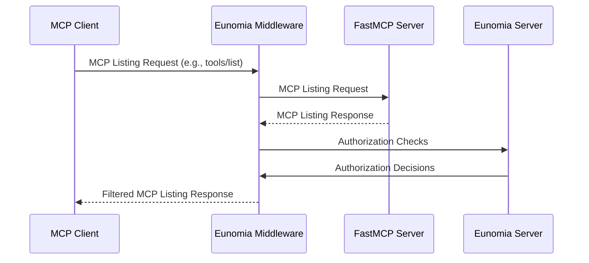
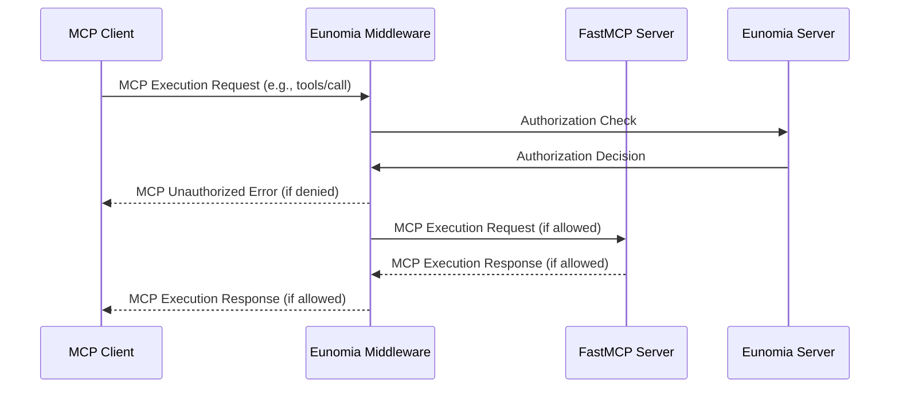

只需添加一行代码，即可通过 **[Eunomia][eunomia-github] 授权中间件**为 FastMCP 服务端加入**基于策略的授权**。

控制 MCP 客户端可以在你的服务端查看和执行哪些工具、资源和提示词。你可以定义基于 JSON 的动态策略，并获取所有访问尝试和违规行为的完整审计日志。

## 工作原理

借助 FastMCP 的[中间件][fastmcp-middleware]，Eunomia 中间件会拦截发送到服务端的所有 MCP 请求，并自动将 MCP 方法映射到授权检查。

### 列表操作

对于列表操作（`tools/list`、`resources/list`、`prompts/list`），该中间件会像过滤器一样工作，向客户端隐藏未被定义策略授权的组件。



### 执行操作

对于执行操作（`tools/call`、`resources/read`、`prompts/get`），该中间件会像防火墙一样工作，阻止未被定义策略授权的操作。



## 为服务端添加授权

<Note>
Eunomia 是面向 AI 的授权服务端，用于处理策略决策。默认情况下，该服务端会嵌入到你的 MCP 服务端中运行，实现零配置；也可以远程运行，以集中处理策略决策。

</Note>

### 创建带授权的服务端

首先，安装 `eunomia-mcp` 包：

```bash
pip install eunomia-mcp
```

然后创建 FastMCP 服务端，并用一行代码添加 Eunomia 中间件：

```python server.py
from fastmcp import FastMCP
from eunomia_mcp import create_eunomia_middleware

# 创建 FastMCP 服务端
mcp = FastMCP("Secure MCP Server 🔒")

@mcp.tool()
def add(a: int, b: int) -> int:
    """将两个数字相加"""
    return a + b

# 向服务端添加中间件
middleware = create_eunomia_middleware(policy_file="mcp_policies.json")
mcp.add_middleware(middleware)

if __name__ == "__main__":
    mcp.run()
```

### 配置访问策略

在终端中使用 `eunomia-mcp` CLI 管理授权策略：

```bash
# 创建默认策略文件
eunomia-mcp init

# 或者为 FastMCP 服务端创建自定义策略文件
eunomia-mcp init --custom-mcp "app.server:mcp"
```

这会创建 `mcp_policies.json` 文件，你可以继续编辑它以满足访问控制需求。

```bash
# 编辑完成后，验证策略文件
eunomia-mcp validate mcp_policies.json
```

### 运行服务端

像平常一样启动 FastMCP 服务端：

```bash
python server.py
```

现在，中间件会拦截所有 MCP 请求，并根据你的策略进行检查。请求会通过 `X-Agent-ID`、`X-User-ID`、`User-Agent` 或 `Authorization` 等 header 包含 agent 标识，并自动将 MCP 方法映射到授权资源和动作。

<Tip>
  有关详细策略配置、自定义身份认证和远程部署，请访问 [Eunomia MCP Middleware
  仓库][eunomia-mcp-github]。
</Tip>

[eunomia-github]: https://github.com/whataboutyou-ai/eunomia
[eunomia-mcp-github]: https://github.com/whataboutyou-ai/eunomia/tree/main/pkgs/extensions/mcp
[fastmcp-middleware]: /zh/servers/middleware
