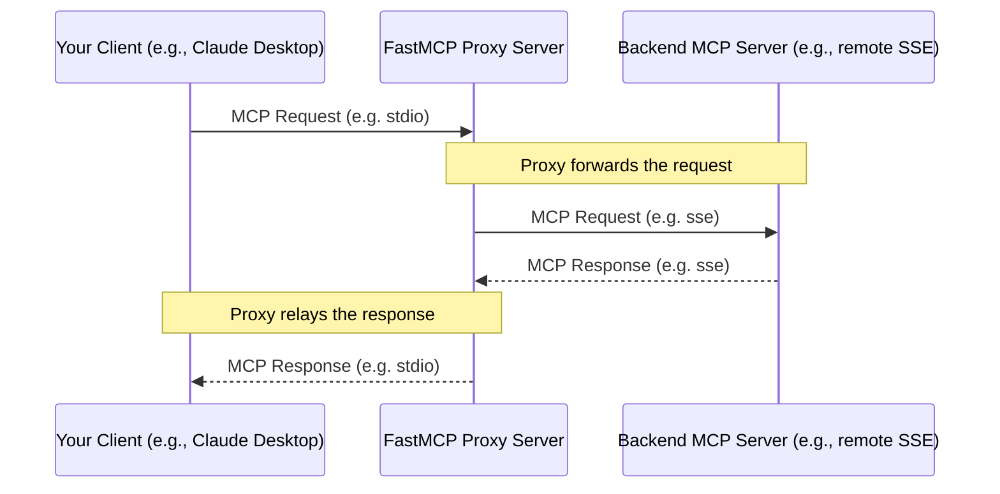

import { VersionBadge } from '/zh/snippets/version-badge.mdx'

<VersionBadge version="2.0.0" />

FastMCP 提供了强大的代理能力，允许一个 FastMCP 服务端实例作为另一个 MCP 服务端的前端（该服务端可以是远程的、运行在不同传输上，甚至也可以是另一个 FastMCP 实例）。这是通过 `FastMCP.as_proxy()` 类方法实现的。

## 什么是代理？

代理意味着设置一个 FastMCP 服务端，它本身并不直接实现自己的工具或资源。相反，当它收到请求（例如 `tools/call` 或 `resources/read`）时，会把该请求转发给一个*后端* MCP 服务端，接收响应，然后再把响应转交回原始客户端。



### 主要优势

<VersionBadge version="2.10.3" />

- **会话隔离**：每个请求都会获得自己的隔离会话，确保并发操作安全
- **传输桥接**：通过不同传输暴露运行在某一种传输上的服务端
- **高级 MCP 特性**：自动转发采样、用户征询、日志和进度
- **安全性**：作为后端服务端的受控网关
- **简单性**：即使后端位置或传输发生变化，也只需要一个端点

### 性能注意事项

使用代理服务端时，尤其是连接到基于 HTTP 的后端服务端时，需要注意延迟可能会比较明显。与本地工具的 1-2ms 相比，`list_tools()` 这类操作可能需要数百毫秒。挂载代理服务端时，这种延迟会影响父服务端上的所有操作，而不只是与被代理工具的交互。

如果你的使用场景要求低延迟，请考虑使用 [`import_server()`](/zh/v2/servers/composition#导入静态组合) 在启动时复制工具，而不是在运行时代理它们。

## 快速开始

<VersionBadge version="2.10.3" />

创建代理的推荐方式是使用 `ProxyClient`，它通过自动会话隔离提供完整的 MCP 特性支持：

```python
from fastmcp import FastMCP
from fastmcp.server.providers.proxy import ProxyClient

# 创建支持完整 MCP 特性的代理
proxy = FastMCP.as_proxy(
    ProxyClient("backend_server.py"),
    name="MyProxy"
)

# 运行代理（例如通过 stdio 供 Claude Desktop 使用）
if __name__ == "__main__":
    proxy.run()
```

这一个设置即可提供：
- 安全的并发请求处理
- 自动转发高级 MCP 特性（采样、用户征询等）
- 会话隔离，防止上下文混用
- 与所有 MCP 客户端完全兼容

你也可以把 FastMCP [客户端传输](/zh/v2/clients/transports)（或可推断为传输的参数）传给 `as_proxy()`。这会自动为你创建一个 `ProxyClient` 实例。

最后，你也可以把常规 FastMCP `Client` 实例传给 `as_proxy()`。这适用于许多使用场景，但如果服务端调用了采样或用户征询等高级 MCP 特性，可能会出问题。

## 会话隔离与并发

<VersionBadge version="2.10.3" />

FastMCP 代理提供会话隔离，以确保并发操作安全。会话策略取决于代理的配置方式：

### 新建会话

当你传入一个未连接的客户端（这是常见情况）时，每个请求都会获得自己的隔离后端会话：

```python
from fastmcp.server.providers.proxy import ProxyClient

# 每个请求都会创建新的后端会话（推荐）
proxy = FastMCP.as_proxy(ProxyClient("backend_server.py"))

# 多个客户端可以同时使用这个代理而互不干扰：
# - 客户端 A 调用工具 -> 获得隔离的后端会话
# - 客户端 B 调用工具 -> 获得不同的隔离后端会话
# - 请求之间不会混用上下文
```

### 使用已连接客户端复用会话

当你传入一个已经连接的客户端时，代理会为所有请求复用该会话：

```python
from fastmcp import Client

# 创建并连接客户端
async with Client("backend_server.py") as connected_client:
    # 这个代理会为所有请求复用已连接的会话
    proxy = FastMCP.as_proxy(connected_client)
    
    # ⚠️ 警告：所有请求共享同一个后端会话
    # 这在并发场景中可能导致上下文混用
```

**重要**：在多个客户端并发请求时使用共享会话，可能导致上下文混用和竞态条件。只有在单线程场景下，或你具备显式同步机制时，才应使用这种方式。

## 传输桥接

一个常见使用场景是桥接传输，也就是通过不同传输暴露运行在某种传输上的服务端。例如，让远程 SSE 服务端通过本地 stdio 可用：

```python
from fastmcp import FastMCP
from fastmcp.server.providers.proxy import ProxyClient

# 将远程 SSE 服务端桥接到本地 stdio
remote_proxy = FastMCP.as_proxy(
    ProxyClient("http://example.com/mcp/sse"),
    name="Remote-to-Local Bridge"
)

# 通过本地 stdio 运行，供 Claude Desktop 使用
if __name__ == "__main__":
    remote_proxy.run()  # 默认使用 stdio 传输
```

或者通过 HTTP 暴露本地服务端以供远程访问：

```python
# 将本地服务端桥接到 HTTP
local_proxy = FastMCP.as_proxy(
    ProxyClient("local_server.py"),
    name="Local-to-HTTP Bridge"
)

# 通过 HTTP 运行，供远程客户端访问
if __name__ == "__main__":
    local_proxy.run(transport="http", host="0.0.0.0", port=8080)
```


## 高级 MCP 特性

<VersionBadge version="2.10.3" />

`ProxyClient` 会在后端服务端与连接到代理的客户端之间自动转发高级 MCP 协议特性，确保完整的 MCP 兼容性。

### 支持的特性

- **Roots**：将文件系统根访问请求转发给客户端
- **采样**：将后端发起的 LLM 补全请求转发给客户端
- **用户征询**：将用户输入请求转发给客户端
- **日志**：将后端日志消息转发到客户端
- **进度**：转发长时间运行操作期间的进度通知

```python
from fastmcp.server.providers.proxy import ProxyClient

# ProxyClient 会自动处理所有这些特性
backend = ProxyClient("advanced_backend.py")
proxy = FastMCP.as_proxy(backend)

# 当后端服务端：
# - 请求 LLM 采样 -> 转发给你的客户端
# - 记录日志消息 -> 显示在你的客户端中
# - 报告进度 -> 显示在你的客户端中
# - 需要用户输入 -> 提示你的客户端
```

### 自定义特性支持

你可以通过为特定处理器传入 `None` 来选择性禁用转发：

```python
# 禁用采样，但保留其他特性
backend = ProxyClient(
    "backend_server.py",
    sampling_handler=None,  # 禁用 LLM 采样转发
    log_handler=None        # 禁用日志转发
)
```

当你直接把传输字符串传给 `FastMCP.as_proxy()` 时，它会在内部自动创建 `ProxyClient`，以确保完整的特性支持。

## 基于配置的代理

<VersionBadge version="2.4.0" />

你可以直接从符合 MCPConfig schema 的配置字典创建代理。这对于快速设置到远程服务端的代理很有用，无需手动配置每个连接细节。

```python
from fastmcp import FastMCP

# 直接从配置字典创建代理
config = {
    "mcpServers": {
        "default": {  # 单服务端配置通常使用 'default'
            "url": "https://example.com/mcp",
            "transport": "http"
        }
    }
}

# 创建指向已配置服务端的代理（自动创建 ProxyClient）
proxy = FastMCP.as_proxy(config, name="Config-Based Proxy")

# 使用 stdio 传输运行代理，供本地访问
if __name__ == "__main__":
    proxy.run()
```

<Note>
MCPConfig 格式遵循一种正在形成的 MCP 服务端配置标准，并可能随着规范成熟而演进。FastMCP 会尽力保持与未来版本兼容，但请注意字段名或结构可能发生变化。
</Note>

### 多服务端配置

你可以通过在配置中指定多个条目来创建指向多个服务端的代理。它们会自动使用配置名称作为前缀进行挂载：

```python
# 多服务端配置
config = {
    "mcpServers": {
        "weather": {
            "url": "https://weather-api.example.com/mcp",
            "transport": "http"
        },
        "calendar": {
            "url": "https://calendar-api.example.com/mcp",
            "transport": "http"
        }
    }
}

# 创建统一的多服务端代理
composite_proxy = FastMCP.as_proxy(config, name="Composite Proxy")

# 工具、资源、提示词和模板可通过前缀访问：
# - 工具：weather_get_forecast, calendar_add_event
# - 提示词：weather_daily_summary, calendar_quick_add
# - 资源：weather://weather/icons/sunny, calendar://calendar/events/today
# - 模板：weather://weather/locations/{id}, calendar://calendar/events/{date}
```

## 组件前缀

代理一个或多个服务端时，组件名称会像挂载和导入时一样添加前缀：

- 工具：`{prefix}_{tool_name}`
- 提示词：`{prefix}_{prompt_name}`
- 资源：`protocol://{prefix}/path/to/resource`（默认路径格式）
- 资源模板：`protocol://{prefix}/...`，模板名称也会加前缀

无论你采用哪种方式，这些规则都会统一适用：
- 将代理挂载到另一个服务端
- 从 `MCPConfig` 创建多服务端代理
- 直接使用 `FastMCP.as_proxy()`

## 镜像组件

<VersionBadge version="2.10.5" />

当你从代理服务端访问工具、资源或提示词时，它们是从远程服务端“镜像”而来的。镜像组件反映的是远程服务端的状态，因此无法直接修改。例如，你不能简单地“禁用”一个镜像组件。

不过，你可以创建镜像组件的副本，并把它存储为新的本地定义组件。本地组件总是优先于镜像组件，因为代理服务端会先检查自己的注册表，然后才尝试访问远程服务端。

因此，如果要启用或禁用某个代理工具、资源或提示词，你应该先创建一个本地副本，并把它添加到自己的服务端。下面是针对工具的示例：

```python
# 创建你自己的服务端
my_server = FastMCP("MyServer")

# 获取代理服务端
proxy = FastMCP.as_proxy("backend_server.py")

# 从代理获取镜像组件
mirrored_tool = await proxy.get_tool("useful_tool")

# 创建一个可由你修改的本地副本
local_tool = mirrored_tool.copy()

# 将本地副本添加到你的服务端
my_server.add_tool(local_tool)

# 现在可以禁用你自己的副本
local_tool.disable()
```


## `FastMCPProxy` 类

在内部，`FastMCP.as_proxy()` 使用 `FastMCPProxy` 类。通常你不需要直接与这个类交互，但在高级场景中如有需要也可以使用它。

### 直接使用

```python
from fastmcp.server.providers.proxy import FastMCPProxy, ProxyClient

# 提供客户端工厂，以便显式控制会话
def create_client():
    return ProxyClient("backend_server.py")

proxy = FastMCPProxy(client_factory=create_client)
```

### 参数

- **`client_factory`**：一个可调用对象，调用时返回 `Client` 实例。这让你可以完全控制会话创建和复用策略。

### 显式会话管理

`FastMCPProxy` 要求显式管理会话，不会执行自动检测。你必须选择自己的会话策略：

```python
# 在所有请求之间共享会话（并发时需谨慎）
shared_client = ProxyClient("backend_server.py")
def shared_session_factory():
    return shared_client

proxy = FastMCPProxy(client_factory=shared_session_factory)

# 为每个请求创建新会话（推荐）
def fresh_session_factory():
    return ProxyClient("backend_server.py")

proxy = FastMCPProxy(client_factory=fresh_session_factory)
```

如果希望自动选择会话策略，请改用便捷方法 `FastMCP.as_proxy()`。

```python
# 带有特定配置的自定义工厂
def custom_client_factory():
    client = ProxyClient("backend_server.py")
    # 在这里添加任何自定义配置
    return client

proxy = FastMCPProxy(client_factory=custom_client_factory)
```
